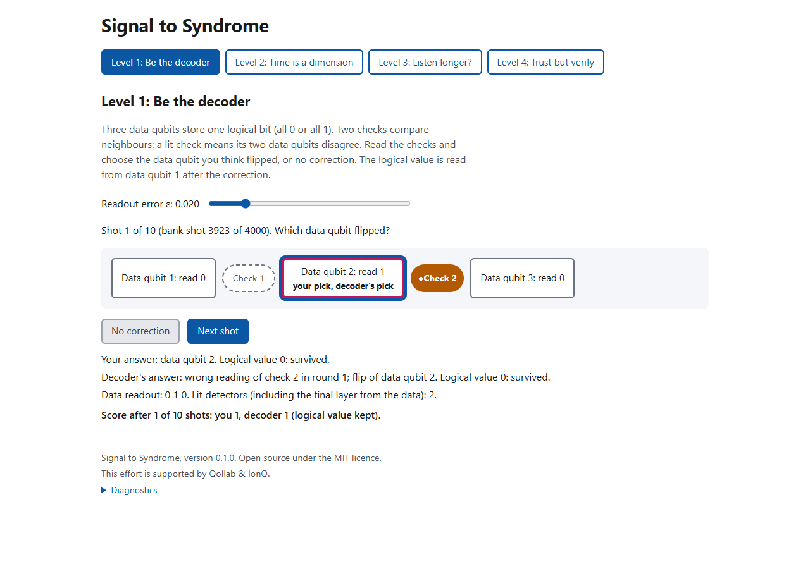
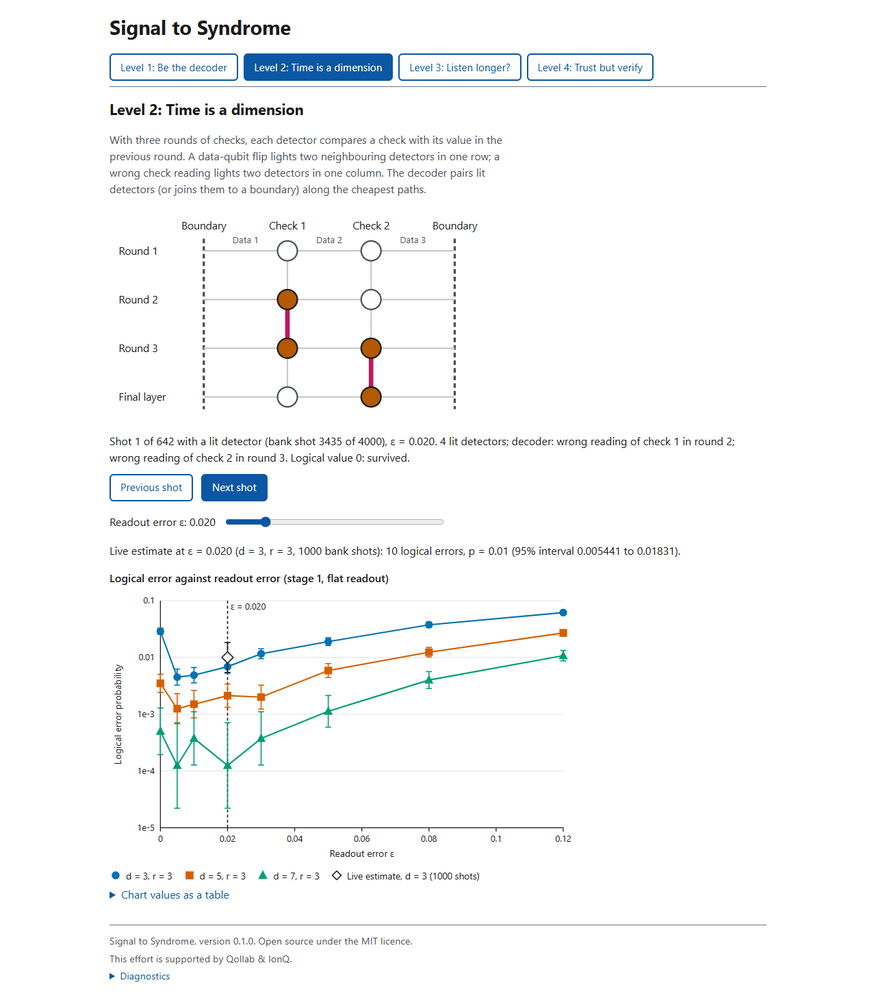
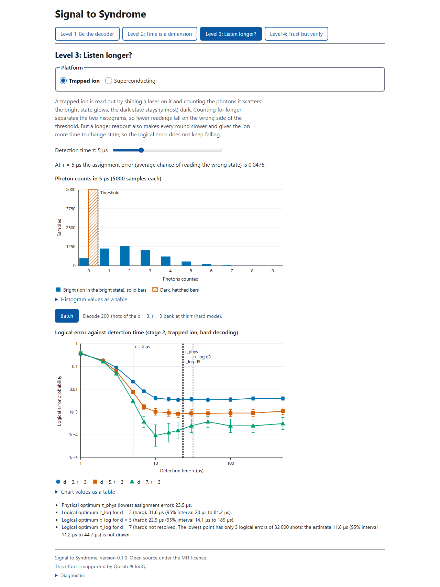
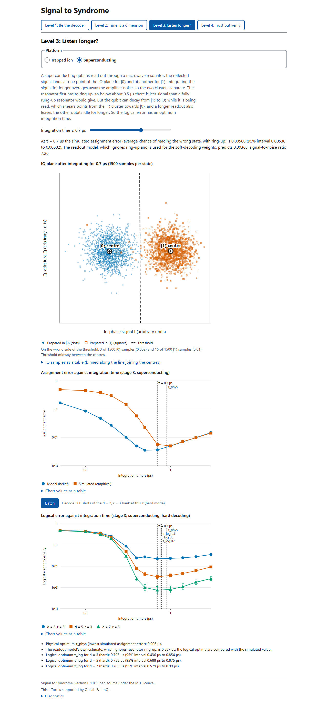
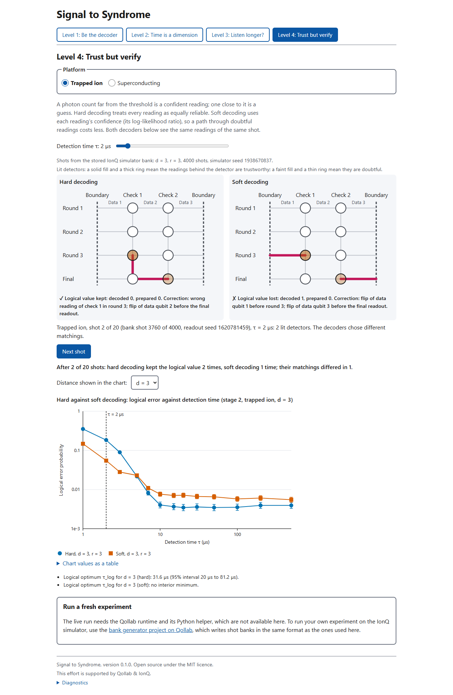
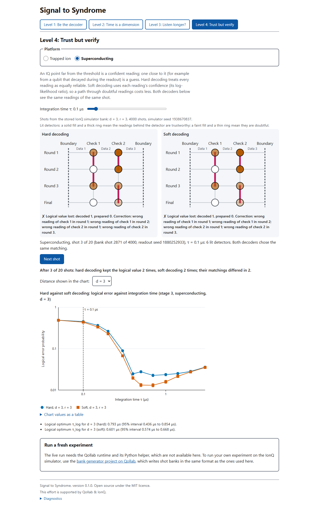

# Signal to Syndrome

<!-- Draft by Person A (CC-A9, Fri 9 Oct 2026). Shared file (CLAUDE.md, Team rules): Person B edits "How to run it", "The five levels" and "Accessibility". Every number carries an HTML comment naming its source file. Intervals are Wilson 95% for error rates and 95% bootstrap (B = 200) for optimal readout times unless stated otherwise (docs/notes_results.md). -->

**Listening longer to a qubit makes its readout cleaner, but the rest of the code keeps ageing while you listen: Signal to Syndrome lets you find, in your browser, the readout time that actually minimises the logical error of an error-corrected memory.**

## What it is

Signal to Syndrome is an open-source lab, published and runnable on Qollab, that shows how qubit-readout physics sets the logical error rate of a repetition-code memory. The circuits are written in Qiskit and run on IonQ's simulator with the forte-1 noise model, submitted in native gates so that IonQ's optimiser does not remove them. Readout is modelled classically in JavaScript (flat, trapped-ion and superconducting models), and the syndromes are decoded by our own exact minimum-weight matching decoder. <!-- source: README.md -->

It is a controlled comparison of readout physics, not a hardware benchmark: both platforms decode the same IonQ-simulator measurement banks with the same gate noise, so every difference between them comes from the readout model, the idle errors and the cycle time. <!-- source: docs/notes_results.md (Verdicts, A28); DECISIONS.md (A28 item 8) -->

Authors: Soumyajit Pal (physics and data) and Sahil Prabhudesai (decoder, interface and platform). <!-- source: README.md -->

## How to run it

- **On Qollab:** open the main project, https://qollab.xyz/u/SQuant/main-project, in a Chromium-based browser (Chrome, Edge or Opera) and run it. Nothing needs installing: the page makes no network requests and all measurement banks and results are embedded. <!-- source: README.md; CLAUDE.md rule 3 --> Pick a level with the buttons at the top; each level opens with a short explanation. The bank generator that produced the measurement data is a separate project: https://qollab.xyz/u/SQuant/signal-to-syndrome-bank-genera. <!-- source: README.md; DECISIONS.md (Person B, published links) -->
- **Live run (optional):** pick IonQ Forte 1 in Qollab's Select QPU dialog, open Level 4 and press the live-run button under "Run a fresh experiment". Each press submits one new d = 3, r = 3 memory experiment (logical 0, 200 shots) <!-- source: src/ui/liverun.js; DECISIONS.md (Person B, CC-A1 part E note) --> to the IonQ simulator with the forte-1 noise model, in native gates, through the Python helper `live.py`, and decodes the new shots on the page. Expect tens of seconds to a few minutes per job. Qollab allows one job per code run, so each press is one job. <!-- source: DECISIONS.md (D11; platform facts); src/ui/liverun.js --> Outside Qollab the panel links to the bank generator instead.
- **Locally:** with Node.js 20 or later <!-- source: README.md -->, run

  ```bash
  npm install
  npm test
  npm run build
  ```

  The build writes `dist/qollab/` (`index.html`, `main.css`, `main.js`), the three files uploaded to Qollab, and `dist/local/preview.html`, a single file that opens directly in a browser (without the live run). <!-- source: README.md; CLAUDE.md rule 3; tools/build.mjs -->
- **Rerun the analysis:** `node tools/sweep.mjs --stage 1` (and `--stage 2`, `--stage 3`, `--stage 4`) regenerates `data/results/*.json`; `node tools/sweep.mjs --diag` prints the V9 fingerprint, which the page also shows under "Diagnostics" at the bottom. <!-- source: docs/notes_results.md; DECISIONS.md (Person A); src/ui/diag.js -->

## The five levels

Every chart has a "Chart values as a table" link under it, and every level works with the keyboard. Screenshots are in `docs/screenshots/`. <!-- source: DECISIONS.md (CC-B10) -->

1. **Be the decoder.** Three data qubits hold one logical bit and two checks compare neighbours. Each shot comes from the stored d = 3 IonQ-simulator bank with flat readout error ε (slider). You read the lit checks and pick the data qubit you think flipped, or no correction; then the decoder's answer, the data readout and whether the logical value survived are shown, and you play ten shots against the decoder. Concept: syndrome → correction. <!-- source: src/ui/level1.js --> 
2. **Time is a dimension.** The same d = 3 code over three rounds, drawn as a space-time grid of detectors: a data-qubit flip lights two neighbours in a row, a wrong check reading lights two in a column, and the decoder's matching is drawn as paths between lit detectors or to a boundary. Step through the shots with a lit detector; the ε slider updates a live estimate (1000 bank shots) on top of the Stage 1 curves for d = 3, 5 and 7. Concept: measurement errors are vertical pairs. <!-- source: src/ui/level2.js --> 
3. **Listen longer?** Choose the trapped ion or the superconducting qubit and move the readout-time slider τ. The ion shows photon-count histograms for bright and dark with the threshold; the superconducting qubit shows the two IQ clouds, the threshold and the signal-to-noise ratio. Charts show the assignment error and the logical error against τ for d = 3, 5 and 7, with the physical optimum τ_phys and the logical optima τ_log marked, and a "Batch" button decodes 200 shots of the d = 3 bank at the current τ. Concept: physical optimum against logical optimum. <!-- source: src/ui/level3.js -->  
4. **Trust but verify.** The same shot is decoded twice, side by side: hard decoding treats every reading as equally reliable, soft decoding uses each reading's confidence. Lit detectors are shaded by confidence (solid fill and thick ring: trustworthy; faint fill and thin ring: doubtful), each panel shows its matching and whether the logical value was kept, and a tally counts 20 shots. A chart compares hard and soft logical error against τ for the chosen distance. This level also holds the live-run panel. <!-- source: src/ui/level4.js; src/ui/liverun.js -->  
5. **Two platforms.** Side-by-side curves for the trapped ion and the superconducting qubit, each on its own readout-time axis, per round or per µs and hard or soft, with the Stage 4 values at τ*_log, a table of the four hypotheses with their verdicts, the comparison and sensitivity tables, and every parameter card with its sources and units. Optima resting on fewer than 10 logical errors are marked "not resolved". <!-- source: src/ui/level5.js --> **Level 5 is switched off in the current build** <!-- source: src/ui/features.js (level5: false) -->; the review items from A28 that concern it are fixed (DECISIONS.md, Person B), and the screenshot `screenshots/level5-preview.png` is from a local build with it switched on.

## The physics in plain language

**The code.** A repetition code stores one bit in d data qubits and repeatedly measures the parity of neighbouring pairs with ancilla qubits. A change in a parity result between rounds (a "detector" event) marks an error; the decoder finds the most likely set of errors that explains all events, and corrects the logical bit. We use d = 3, 5 and 7 with r = 3 rounds. <!-- source: docs/notes_results.md (Stage 1); CLAUDE.md Conventions --> Each measurement bank comes from 4000 shots on IonQ's simulator with forte-1 noise in native gates. <!-- source: docs/notes_results.md (Stage 1); DECISIONS.md (D8) --> The forte-1 model adds gate noise but no readout error, so readout is added afterwards by our classical models. <!-- source: DECISIONS.md (platform facts) -->

**Stage 1: flat readout.** Every measurement is flipped with the same probability ε. This isolates the decoder and the gate-noise floor: the simulator's gate noise corresponds to a calibrated per-edge error of about pGate ≈ 0.013 <!-- source: docs/notes_results.md (Stage 1) -->, and below about ε = 0.03 <!-- source: docs/notes_results.md (Stage 1) --> that floor, not readout, sets the logical error.

**Stage 2: trapped-ion fluorescence readout.** A bright ion scatters photons and a dark one does not; the detector counts photons for a time τ. Counting longer separates the two better, but laser light can also pump the ion from one state to the other during the window, which makes long windows worse again. The model uses published lab rates for ¹⁷¹Yb⁺ (Crain et al. 2019): 0.472 counts/µs bright, 4.2e-6 counts/µs background, pumping 3.41e-4 /µs bright→dark and 1.64e-5 /µs dark→bright. <!-- source: params/ion.json --> These are lab values, not measured Forte characteristics. <!-- source: DECISIONS.md (A15) --> Idle errors on the waiting data qubits are negligible because T1 is long (1e7 µs, i.e. 10 s). <!-- source: params/ion.json -->

**Stage 3: superconducting dispersive readout.** A microwave resonator coupled to the qubit shifts its response depending on the qubit state; we integrate the reflected signal for a time τ. The resonator first has to ring up, so very short readouts carry little signal; long readouts suffer because the qubit can decay (T1) during the window, and the data qubits decay while they wait. The card uses representative values, not one device: χ/2π = 1 MHz, κ/2π = 2 MHz, n̄ = 5 photons (unsourced, illustrative), η = 0.3, T1 = 50 µs, heterodyne detection, ring-up on. <!-- source: params/sc.json -->

**Stage 4: comparison.** For each platform we convert the logical error after r rounds into a per-round rate, ½[1 − (1 − 2pL)^(1/r)], and divide by the cycle time (2 gate layers × two-qubit gate time + τ + reset time) to get a rate per microsecond. <!-- source: docs/signal-to-syndrome-project-plan (standalone).md §16.5; params/cycle.json --> Cycle-card values: ion two-qubit gate 970 µs and reset 50 µs; superconducting two-qubit gate 0.042 µs and reset 0.25 µs. <!-- source: params/cycle.json --> We also locate the break-even readout quality at which d = 5 beats d = 3, and rerun everything with each parameter halved and doubled (a sensitivity sweep of 28 rows). <!-- source: docs/notes_results.md (Verdicts); plan §16.5 -->

**Hard and soft decoding.** A hard decoder sees only the bit each readout reports. A soft decoder also uses how confident each readout was (its log-likelihood ratio) and makes uncertain readings cheaper to blame for an error. <!-- source: CLAUDE.md Conventions (edge weights) -->

## What runs where

| Part | Where it runs | Notes |
|---|---|---|
| Repetition-code circuits (gate noise) | **IonQ simulator**, forte-1 noise model, native gates, submitted from Qiskit on Qollab | One configuration per run, 4000 shots, fixed `sampler_seed`; stored as banks in `data/banks/`. <!-- source: DECISIONS.md (D1, D2, D8) --> |
| V4 injection check | **IonQ simulator**, `ideal` noise model, 100 shots per site | <!-- source: DECISIONS.md (A23) --> |
| Live run (optional) | **IonQ simulator**, forte-1, through `live.py` on Qollab | 200 shots per press. <!-- source: DECISIONS.md (Person B, CC-A1 part E note; D11) --> |
| Readout models (flat, trapped-ion, superconducting) | **Classical**, JavaScript in the browser (and Node.js for the sweeps) | Applied to the simulated bits; not part of the IonQ simulation. <!-- source: README.md; DECISIONS.md (platform facts) --> |
| Idle errors on waiting data qubits | **Classical**, JavaScript | <!-- source: CLAUDE.md Conventions --> |
| Decoder | **Classical**, our exact minimum-weight matching in JavaScript | <!-- source: README.md --> |
| PyMatching comparison (V2), circuit tests (V3) | **Classical**, local Python | Not shipped. <!-- source: CLAUDE.md rule 5; README.md --> |

## Results: hypotheses C1–C4

The plan stated four hypotheses, each with a refutation condition; refutation is a valid result. <!-- source: plan §12 --> Our verdicts use the full-statistics runs. The automated verdicts in `stage4_comparison.json` and the reduced-statistics sensitivity sweep need the caveats given below. <!-- source: docs/notes_results.md (Verdicts, A28) -->

| | Hypothesis (short) | Verdict |
|---|---|---|
| C1 | Superconducting: interior optimum τ*_log < τ*_phys, driven by idle errors. Ion: no idle-driven optimum | **Held** at d = 3 and 5; **undetermined** at d = 7 <!-- source: docs/notes_results.md (Verdicts) --> |
| C2 | Soft decoding is at or below hard at every τ, with most gain at short τ | **Refuted** as stated (fails on the ion arm, holds on the superconducting arm) <!-- source: docs/notes_results.md (Verdicts) --> |
| C3 | Ion better per round, but the order reverses per µs | **Refuted** <!-- source: docs/notes_results.md (Verdicts) --> |
| C4 | Break-even ε̄ (d = 5 beats d = 3) similar on both platforms | **Refuted** on the empirical ε̄ axis; **undetermined** on the belief axis <!-- source: docs/notes_results.md (Verdicts) --> |

### C1: where is the best readout time?

- **Ion.** The assignment error has a minimum at τ*_phys = 23.5 µs <!-- source: data/results/stage2_ion.json (optima.tauPhys = 23.4849) -->; the empirical error is 5.7e-4 [4.8e-4, 6.9e-4] at 20 µs and rises to 5.0e-3 [4.7e-3, 5.3e-3] at 500 µs, driven by dark→bright pumping. <!-- source: docs/notes_results.md (F1-ion) --> The hard-mode logical optima contain it: τ*_log = 31.6 µs [20.0, 81.2] at d = 3 (an exact tie of 20 and 50 µs) and 22.9 µs [14.1, 189] at d = 5. <!-- source: data/results/stage2_ion.json (optima.tauLog) --> The idle flip probability is at most 2.5e-5 on the grid, about 20× below the readout error at τ*_phys, so no optimum is idle-driven. <!-- source: docs/notes_results.md (Verdicts, C1); data/results/stage4_comparison.json (conclusions.C1 maxIdle) --> The minimum is shallow: from 10 to 500 µs the d = 3 hard logical error stays between 0.0035 [0.0029, 0.0042] and 0.0040 [0.0034, 0.0048]. <!-- source: docs/notes_results.md (Ion arm) --> The d = 7 hard value, 11.8 µs [11.2, 44.7], rests on 3, 4 and 5 errors of 32 000 and is **not resolved**. <!-- source: docs/notes_results.md (Stage 2, τ*_log) -->
- **Superconducting.** The empirical assignment error has its minimum at τ*_phys = 0.906 µs. <!-- source: docs/notes_results.md (Stage 3); data/results/stage4_comparison.json (conclusions.C1 tauPhys = 0.9057) --> Every logical optimum is interior, and at d = 3 and 5 it lies below τ*_phys beyond its interval: <!-- source: docs/notes_results.md (Stage 3) -->

| d | Hard τ*_log (µs) | Soft τ*_log (µs) |
|---|---|---|
| 3 | 0.793 [0.436, 0.854] | 0.601 [0.574, 0.668] <!-- source: data/results/stage3_sc.json (optima.tauLog) --> |
| 5 | 0.756 [0.688, 0.875] | 0.592 [0.569, 0.857] <!-- source: data/results/stage3_sc.json (optima.tauLog) --> |
| 7 | 0.783 [0.579, 0.990] | 0.582 [0.553, 1.311] <!-- source: data/results/stage3_sc.json (optima.tauLog) --> |

  At d = 7 both intervals contain 0.906 µs, so the shift is not resolved there. <!-- source: docs/notes_results.md (Stage 3) --> Each extra µs of readout costs about 1% idle flips per round on the data qubits, which the single-qubit assignment error does not count, so the logical optimum comes earlier. <!-- source: docs/notes_results.md (Verdicts, C1) -->
- **Caveat.** The superconducting belief model ignores resonator ring-up, so its τ*_phys is 0.587 µs; against that value there is no shift. The verdict rests on the empirical value. <!-- source: data/results/stage3_sc.json (optima.tauPhys = 0.586604); docs/notes_results.md (Ring-up mismatch) --> The automated Stage 4 verdict "flips" for C1 comes from a stricter rule (idle probability below 1e-6 at every τ) that is crossed between 20 and 30 µs on the ion grid; it is not an idle-driven minimum. <!-- source: docs/notes_results.md (Verdicts, C1) -->

### C2: does soft decoding always help? Refuted.

- **Superconducting:** soft is at or below hard at 36 of 36 points, below beyond the intervals at 20, above at none. Largest gain: d = 7 at 0.3 µs, 0.0122 [0.0110, 0.0134] against 0.0298 [0.0280, 0.0317]. <!-- source: docs/notes_results.md (Verdicts, C2); data/results/stage4_comparison.json (conclusions.C2) -->
- **Ion:** soft wins strongly where the readout is photon-starved (τ ≤ 3–5 µs), e.g. d = 7 at 1 µs, 0.0499 [0.0475, 0.0523] against 0.394 [0.389, 0.400]. <!-- source: docs/notes_results.md (Ion arm) --> From 7 µs on it loses: above hard beyond the intervals at 11 points, 9 of them at d = 3 (e.g. 20 µs: 0.0072 [0.0063, 0.0081] against 0.0035 [0.0029, 0.0042]). <!-- source: docs/notes_results.md (Verdicts, C2); data/results/stage4_comparison.json (conclusions.C2) -->
- **Why:** once ion readout errors (≈ 6e-4) are far below the gate noise (≈ 0.013), nearly every matching costs the same under the decoder's single uniform gate-noise model, and small confidence differences break those near-ties in a way that fits the simulator's real gate noise worse. On synthetic data drawn from the decoder's own model, soft wins. <!-- source: docs/notes_results.md (Stage 2, Diagnosis) --> The second half of C2 (most gain at short τ) holds on both arms. <!-- source: docs/notes_results.md (Verdicts, C2) -->
- The sensitivity sweep reports "holds" in all 28 rows, but at n ≤ 2000 per point it cannot see the ion loss; that is too little statistical power, not robustness. <!-- source: docs/notes_results.md (Verdicts, C2) -->

### C3: per round against per microsecond. Refuted.

The ion arm is lower in both metrics, so the ordering never reverses. Values at τ*_log: <!-- source: docs/notes_results.md (Verdicts, C3) -->

| d, mode | Per round, ion | Per round, SC | Per µs, ion | Per µs, SC |
|---|---|---|---|---|
| 3 hard | 1.20e-3 [1.00e-3, 1.44e-3] | 7.78e-3 [7.23e-3, 8.36e-3] | 5.92e-7 | 6.90e-3 <!-- source: docs/notes_results.md (C3 table); data/results/stage4_comparison.json --> |
| 5 hard | 2.85e-4 [1.96e-4, 4.14e-4] | 1.11e-3 [9.2e-4, 1.34e-3] | 1.42e-7 | 1.02e-3 <!-- source: docs/notes_results.md (C3 table); data/results/stage4_comparison.json --> |
| 7 hard | 3.6e-5 [1.3e-5, 9.8e-5] | 2.57e-4 [1.73e-4, 3.80e-4] | 1.8e-8 | 2.30e-4 <!-- source: docs/notes_results.md (C3 table); data/results/stage4_comparison.json --> |
| 3 soft | 1.84e-3 [1.59e-3, 2.13e-3] | 4.41e-3 [4.01e-3, 4.86e-3] | 7.39e-7 | 4.72e-3 <!-- source: docs/notes_results.md (C3 table); data/results/stage4_comparison.json --> |
| 5 soft | 3.86e-4 [2.80e-4, 5.32e-4] | 7.41e-4 [5.87e-4, 9.34e-4] | 1.55e-7 | 8.00e-4 <!-- source: docs/notes_results.md (C3 table); data/results/stage4_comparison.json --> |
| 7 soft | 8.5e-5 [4.3e-5, 1.66e-4] | 1.87e-4 [1.18e-4, 2.95e-4] | 3.9e-8 | 2.04e-4 <!-- source: docs/notes_results.md (C3 table); data/results/stage4_comparison.json --> |

Per round the ion arm is lower in 5 of 6 cases beyond the intervals (d = 7 soft overlaps); per µs it is lower by about 10⁴ in every case. <!-- source: docs/notes_results.md (Verdicts, C3) --> Cycle times at τ*_log are 2002–2490 µs for the ion and 0.92–1.13 µs for the superconducting arm. <!-- source: docs/notes_results.md (Verdicts, C3) --> Dividing by a longer cycle can only lower a rate per µs, so the ion's slow clock widens its lead in this metric; the cost of a slow clock would show in a metric such as time to finish a fixed number of logical operations, which we did not measure. <!-- source: docs/notes_results.md (Verdicts, C3) --> No sensitivity row reverses the ordering (27 flips, 1 undetermined). <!-- source: docs/notes_results.md (Verdicts table) -->

### C4: break-even readout quality. Refuted on the empirical axis.

- **Ion:** hard-mode break-even ε̄ = 0.236 [0.210, 0.267] at τ = 1.56 µs; in soft mode d = 5 is below d = 3 at every τ, so there is no break-even. <!-- source: data/results/stage4_comparison.json (platforms.trapped-ion.breakEven) -->
- **Superconducting:** no crossing in either mode; d = 5 is below d = 3 at every grid point. At τ = 0.1 µs (empirical ε̄ = 0.448) it is still below beyond the intervals: 0.4377 [0.4323, 0.4432] against 0.4533 [0.4479, 0.4588]. So the break-even lies above ε̄ ≈ 0.45, at least 0.18 above the ion's upper bound. <!-- source: docs/notes_results.md (Verdicts, C4); data/results/stage4_comparison.json (platforms.superconducting.breakEven) -->
- On the belief axis (which ignores ring-up) the superconducting grid only reaches ε̄ = 0.166, so its break-even is only bounded below and the automated rule reports "undetermined". <!-- source: docs/notes_results.md (Verdicts, C4) -->
- **Why:** ε̄ is not platform-neutral. The ion error is one-sided (only bright ions are misread, at about 0.48 at break-even), while the superconducting error is nearly symmetric (0.459 and 0.471 for |0⟩ and |1⟩ at 0.1 µs). The readout time needed differs by more than 15× (ion 1.56 µs against superconducting below 0.1 µs). <!-- source: docs/notes_results.md (Verdicts, C4) -->

### Stage 1 baseline (flat readout)

Distance helps at every ε: at ε = 0.05 the logical error is 0.0190 [0.0162, 0.0222] at d = 3, 0.0059 [0.0044, 0.0078] at d = 5 and 0.0011 [0.0006, 0.0021] at d = 7 (n = 8000 per point), and the curves do not cross up to ε = 0.12. <!-- source: data/results/stage1_flat.json; docs/notes_results.md (Stage 1) --> The ε = 0 point (0.0289 at d = 3) is a decoder tie artefact, not physics. <!-- source: docs/notes_results.md (Stage 1) -->

## Validation V1–V10

| ID | Check | Outcome |
|---|---|---|
| V1 | Flat model flip rate equals ε | **Pass:** 0.04936 [0.04842, 0.05032] at ε = 0.05, 200 000 draws <!-- source: docs/notes_results.md (Stage 1 validation) --> |
| V2 | Our decoder against PyMatching | **Pass:** 0 genuine mismatches and 0 cost mismatches on 20 000 synthetic shots per configuration; exact ties counted (d3 r3 389, d5 r3 88, d5 r5 122, d7 r3 14) <!-- source: DECISIONS.md (Person B, V2) --> |
| V3 | Circuits on Qiskit's ideal simulator; one injected X gives the predicted bits | **Pass:** 22/22 tests <!-- source: DECISIONS.md (Person B, CC-A1 part E note) --> |
| V4 | Idle-error injection rule against an explicit X gate on IonQ's ideal simulator | **Pass:** all 24 injection sites (9 at d = 3, 15 at d = 5) bit for bit <!-- source: docs/notes_results.md (Stage 3 validation); DECISIONS.md (A23) --> |
| V5 | Gate-noise floor consistent across banks | **Pass,** with one note: pGate 0.0124–0.0139 for r ≥ 3; L0 and L1 firing-rate intervals overlap except d = 7, r = 3 (0.0501 against 0.0533, about 6% apart) <!-- source: docs/notes_results.md (Stage 1 validation) --> |
| V6 | Logical 0 against logical 1 | **Pass:** intervals overlap at all 24 points (flat readout). With ion soft decoding there is a strong, intrinsic L0/L1 asymmetry, reported under C2 <!-- source: docs/notes_results.md (Stage 1 validation; Stage 2, L0 against L1) --> |
| V7 | Ion sampler against Poisson tails (no pumping) | **Pass:** within 4 SE at all 13 grid points <!-- source: docs/notes_results.md (Stage 2 validation) --> |
| V8 | Superconducting sampler against ½ erfc(SNR/2√2) (no decay, no ring-up) | **Pass:** within 4 SE at all 12 τ; the U-curve appears with finite T1 <!-- source: docs/notes_results.md (Stage 3 validation; F1-sc) --> |
| V9 | Browser against Node.js fingerprint | Node.js fingerprint `53933f98`. An earlier fingerprint (`e80b58c8`) was shown on Qollab on Wed 7 Oct; the browser comparison against the current fingerprint is **not measured** yet <!-- source: DECISIONS.md (Person A V9 row; Person B published links) --> |
| V10 | Confidence (llr) calibration where belief equals truth | **Pass** on both arms, e.g. bin [1, 2): ion 0.1965 against 0.1957, superconducting 0.1856 against 0.1853. With ring-up on, the superconducting calibration fails in every bin (information, not a check) <!-- source: docs/notes_results.md (Stage 2 and 3 validation) --> |

## Accessibility

- **Keyboard:** every control (level buttons, sliders, platform choices, qubit buttons, the live-run button) can be reached and used with the keyboard, the tab order follows the visual order, and focus is always visible (a 3 px outline). Choosing a level moves focus to its heading. <!-- source: DECISIONS.md (CC-B10); src/ui/main.js -->
- **Charts and pictures:** every chart and histogram has a values table, and the qubit grids and charts have text descriptions for screen readers. <!-- source: DECISIONS.md (CC-B10) -->
- **Colour:** a colour-blind-safe palette, and nothing relies on colour alone: series also differ by marker shape, histograms by solid and hatched bars, and in Level 1 "your pick" and "decoder's pick" are written on the qubit. <!-- source: DECISIONS.md (CC-B10); src/ui/level3.js --> The lowest text contrast pair is 4.83:1 <!-- source: DECISIONS.md (CC-B10) -->, above the plan target of 4.5:1. <!-- source: plan §18 -->
- **Small screens:** the layout was checked at 360 px width; wide tables scroll inside their own box and charts are redrawn larger below 600 px. <!-- source: DECISIONS.md (CC-B10) -->
- **Motion:** nothing animates. <!-- source: DECISIONS.md (CC-B10) -->

## Limitations

- **Not a hardware benchmark and not a platform ranking.** Both readout models are classical models with literature parameters, applied to the same simulated IonQ gate noise. <!-- source: plan §20 -->
- **The ion readout uses a published lab setup** (Crain et al. 2019, SNSPD), not measured Forte characteristics; IonQ publishes no Forte detection rates. The ion T1 is the low end of the range given for IonQ Aria. <!-- source: DECISIONS.md (A15); params/ion.json -->
- **The superconducting card is representative, not one device;** n̄ = 5 is unsourced and illustrative. <!-- source: params/sc.json --> The superconducting reset time is still marked "check against the paper". <!-- source: params/cycle.json; DECISIONS.md (A28 item 7) -->
- **The superconducting belief model ignores ring-up,** so belief and empirical assignment errors disagree for τ ≤ 0.7 µs, soft weights there are overconfident, and τ*_phys has two values (0.587 µs belief, 0.906 µs empirical). <!-- source: docs/notes_results.md (Ring-up mismatch) -->
- **The decoder's gate-noise model is one uniform rate for every edge,** with no correlated or diagonal circuit faults; this is the likely cause of the ion soft-decoding loss (C2). <!-- source: docs/notes_results.md (Stage 2, Diagnosis) -->
- **Ties in matching are broken toward observable parity 0,** which inflates the logical error at ε = 0 and may slightly inflate it at small d. <!-- source: DECISIONS.md (Person B, V2); docs/notes_results.md (Stage 1) -->
- **The sensitivity sweep runs at reduced statistics** (R = 1, at most 1000 shots per bank, no bootstrap), so it cannot test C1 or C2. <!-- source: docs/notes_results.md (Verdicts) -->
- **Small codes:** distance up to 7 and r = 3 rounds for the main curves; threshold values are not extrapolated. <!-- source: plan §20; docs/notes_results.md --> The repetition code protects against bit flips only. Idle errors use the Pauli-twirling approximation of amplitude damping, and the ion model allows at most one state change per detection window. <!-- source: plan §20 -->
- **Untested:** the time to finish a fixed number of logical operations (the metric where a slow cycle would cost the ion arm) was not measured. <!-- source: docs/notes_results.md (Verdicts, C3) -->

## How to extend the project

- **Add a readout model:** implement the readout contract, `measure(trueBit, rng) -> { hard, llr }`, `idleFlipProbability()` and `averageAssignmentError()`, in `src/core/readout/`, and add a parameter card with a source for every value in `params/`. <!-- source: CLAUDE.md (Conventions, Module API) -->
- **Generate new banks:** run `qollab/bank_generator.py` on Qollab, one configuration per run, with the native recipe and a distinct `sampler_seed` per bank; check that the detector rate is above 0. <!-- source: DECISIONS.md (D1, D2, bank generator rules) -->
- **Open problems we found:**
  - Per-edge-class gate rates estimated from detector-pair correlations (in `graph.js` and `calibrate.js`), to test whether the ion soft-decoding loss disappears. <!-- source: docs/notes_results.md (Stage 2, Diagnosis) -->
  - Ring-up in the superconducting belief model (`src/core/readout/sc.js`), which would change every Stage 3 number. <!-- source: docs/notes_results.md (Ring-up mismatch) -->
  - A different tie-break in `matching.js`. <!-- source: DECISIONS.md (Person B, V2) -->
  - A photomultiplier-tube ion setup with lower collection efficiency, and the dark→bright pumping rate, which mainly sets the ion τ*_phys, as sensitivity cases. <!-- source: DECISIONS.md (A15) -->
- **Fork it on Qollab** ([fork and remix](https://qollab.xyz/learn/docs/fork-and-remix)) and change the parameter cards. <!-- source: DECISIONS.md (Sources) -->

## References

Readout parameters and cycle times:

- C. Crain et al., Commun. Phys. 2, 97 (2019): [nature.com/articles/s42005-019-0195-8](https://www.nature.com/articles/s42005-019-0195-8)
- S. Noek et al., Opt. Lett. 38, 4735 (2013): [arXiv:1304.3511](https://arxiv.org/abs/1304.3511)
- S. Olmschenk et al. (2007): [arXiv:0708.0657](https://arxiv.org/abs/0708.0657)
- Microsoft Azure Quantum, IonQ provider page: [learn.microsoft.com/azure/quantum/provider-ionq](https://learn.microsoft.com/azure/quantum/provider-ionq)
- T. Walter et al., "Rapid high-fidelity single-shot dispersive readout of superconducting qubits," Phys. Rev. Applied 7, 054020 (2017): [arXiv:1701.06933](https://arxiv.org/abs/1701.06933)
- Robertson et al., "Variational Gibbs State Preparation on Trapped-Ion Devices" (2026): [arXiv:2603.03801](https://arxiv.org/abs/2603.03801)
- Google Quantum AI and Collaborators, "Quantum error correction below the surface code threshold," Nature 638, 920 (2025): [arXiv:2408.13687](https://arxiv.org/abs/2408.13687)
- M. McEwen et al., "Removing leakage-induced correlated errors in superconducting quantum error correction," Nat. Commun. 12, 1761 (2021): [arXiv:2102.06131](https://arxiv.org/abs/2102.06131)

Error correction, decoding and soft information:

- D. Gottesman, *Stabilizer Codes and Quantum Error Correction*, PhD thesis, Caltech (1997): [arXiv:quant-ph/9705052](https://arxiv.org/abs/quant-ph/9705052)
- E. Dennis, A. Kitaev, A. Landahl and J. Preskill, "Topological quantum memory," J. Math. Phys. 43, 4452 (2002)
- J. Edmonds, "Paths, trees, and flowers," Can. J. Math. 17, 449 (1965)
- O. Higgott, "PyMatching: A Python package for decoding quantum codes with minimum-weight perfect matching," ACM Trans. Quantum Comput. 3, 16 (2022)
- O. Higgott and C. Gidney, "Sparse Blossom" (2023): [arXiv:2303.15933](https://arxiv.org/abs/2303.15933)
- C. A. Pattison, M. E. Beverland, M. P. da Silva and N. Delfosse, "Improved quantum error correction using soft information" (2021): [arXiv:2107.13589](https://arxiv.org/abs/2107.13589)
- J. Gambetta et al., "Protocols for optimal readout of qubits using a continuous quantum nondemolition measurement," Phys. Rev. A 76, 012325 (2007)
- A. Blais, A. L. Grimsmo, S. M. Girvin and A. Wallraff, "Circuit quantum electrodynamics," Rev. Mod. Phys. 93, 025005 (2021)
- A. H. Myerson et al., "High-fidelity readout of trapped-ion qubits," Phys. Rev. Lett. 100, 200502 (2008)

Statistics:

- E. B. Wilson, J. Am. Stat. Assoc. 22, 209 (1927)
- B. Efron, "Bootstrap methods: another look at the jackknife," Ann. Statist. 7, 1 (1979)

Platform:

- Qollab documentation: [runtime environment](https://qollab.xyz/learn/docs/runtime-environment), [JavaScript Qiskit projects](https://qollab.xyz/learn/docs/js-qiskit-projects), [Python Qiskit projects](https://qollab.xyz/learn/docs/python-qiskit-projects), [ideal vs noise-model simulators](https://qollab.xyz/learn/docs/ideal-vs-noise-model-simulators), [how your circuit is compiled](https://qollab.xyz/learn/docs/how-your-circuit-is-compiled)
- IonQ: [Simulation with noise models](https://docs.ionq.com/guides/simulation-with-noise-models), [Getting started with native gates](https://docs.ionq.com/features/getting-started-with-native-gates), [Native gates in Qiskit](https://docs.ionq.com/sdks/qiskit/native-gates-qiskit)
- [qiskit-ionq](https://github.com/qiskit-community/qiskit-ionq)

<!-- References without a link: the source files give no URL; the plan asks that bibliographic details be verified against the publisher before they appear here. -->

## AI assistance and planning disclosure

Placeholder: planning documents and prompts were prepared before the build window; all code was generated during the window with Claude Code under the authors' direction and reviewed by the authors. <!-- source: README.md (verbatim; README still marks it as a placeholder) -->

## Licence

MIT. See [LICENSE](../LICENSE). <!-- source: README.md -->

This effort is supported by Qollab & IonQ.
