# Signal to Syndrome — Execution Checklist

> **Superseded for the two-person build (6 Oct 2026).** Use `signal-to-syndrome-team-checklist.md`. The probe results in `DECISIONS.md` override this file wherever they differ: Qollab file names are `index.html` (body fragment), `main.css` and `main.js`; one job per Qollab run; bank circuits use IonQ's native gates with the seed set by `set_options(sampler_seed=…)`. The `CLAUDE.md` text embedded below is out of date; the repository's `CLAUDE.md` is authoritative.

Every step needed to build, verify, publish and submit the project, in the order you do them. Companion to `signal-to-syndrome-project-plan.md` (the what and why) and `signal-to-syndrome-proposal.md` (the physics).

| | |
|---|---|
| Version | 1.0, 4 October 2026 |
| Build window | Sat 10 Oct 04:30 IST → Mon 12 Oct 04:30 IST (Fri 9 Oct 19:00 ET → Sun 11 Oct 19:00 ET) |
| Repository | `E:\My Project\signal-to-syndrome` (change it in step C1 if you prefer another location) |
| Terminal | VS Code with the **cmd** terminal; every command below is cmd syntax |

---

## How to use this checklist

1. Work top to bottom. Each step has an ID, one or more type tags, a target start time (IST), a **Why**, a **Do** and a **Pass** criterion. Tick **Done** only when the Pass criterion holds.
2. When a step says **EDITOR**, you create or edit a file in VS Code. When it says **TERMINAL**, you type commands in VS Code's cmd terminal. When it says **QOLLAB**, you work in the browser on qollab.xyz.
3. Claude Code prompts are complete and can be pasted as they are. Before each one, type `/clear` in Claude Code so it starts fresh and rereads `CLAUDE.md`.
4. If a step's Pass criterion fails, fix it before moving on, unless the stage's cut deadline has arrived. Then apply the cut rule in plan §8.2 and continue.
5. Record every platform answer and every deviation in `DECISIONS.md`. If it isn't written there, it didn't happen.

### Step types

| Tag | Meaning |
|---|---|
| SELF | You do it by hand: reading, deciding, writing, recording |
| CLAUDE CODE | Paste the given prompt into Claude Code, running in the repository folder |
| TERMINAL | Run the given commands in VS Code's cmd terminal |
| EDITOR | Create or edit a file in VS Code |
| QOLLAB | Work in the browser on qollab.xyz |
| PLATFORM | A platform-compatibility check; the result goes into `DECISIONS.md` |
| VERIFY | A validation gate with a numerical or behavioural pass criterion |
| REVIEW | Independent review in a fresh Claude chat (not the Claude Code session that wrote the code) |
| GIT | Version control |
| PUBLISH | Publish or update on Qollab |

### Ground rules

- **Nothing that is project code exists before Sat 10 Oct 04:30 IST.** Phase A is reading, deciding, paper derivations, literature, and installing tools. The probe snippets in Phase B are disposable platform tests that never enter the repository.
- **The Claude Code prompts below are planning text written before the window.** They are only executed after T0. Say so in the README's disclosure section (step G3).
- **Commit after every green test run.** Tag every ship point (`sp1` … `sp4`).
- **Never weaken a test to make it pass.** If a test fails, either the code or the test is wrong, and you decide which by reasoning, not by convenience.
- **From Sun 22:30 IST: no new features.**


## Overview

```mermaid
%%{init: {"flowchart": {"curve": "step", "nodeSpacing": 40, "rankSpacing": 50}, "themeVariables": {"fontSize": "14px"}}}%%
flowchart LR
    A["A. Before the window<br/>reading, derivations, tools"] --> B["B. Probe<br/>Sat 04:30"]
    B --> C["C. Stage 1 core<br/>SP1 at 14:00"]
    C --> D["D. Stage 2 ion<br/>SP2 at 21:00"]
    D --> E["E. Stage 3 superconducting<br/>SP3 at Sun 11:00"]
    E --> F["F. Stage 4 comparison<br/>SP4 at 16:00"]
    F --> G["G. Page and demo"]
    G --> H["H. Buffer, fixes only"]
    H --> I["I. Freeze and submit<br/>by Mon 01:30"]
```



### Step index

| ID | Target time (IST) | Type | Step |
|---|---|---|---|
| A1 | by Tue 6 Oct | SELF | Register and choose a node |
| A2 | Sun 4 – Tue 6 Oct | SELF | Read the rules and the submission process |
| A3 | week of 5 Oct | SELF | Ask the open questions at the AMA |
| A4 | Mon 5 Oct | TERMINAL | Install and verify the tools |
| A5 | Mon 5 Oct | TERMINAL | Create the validation environment |
| A6 | Tue 6 Oct | QOLLAB | Learn the platform with Qollab's own starter material |
| A7 | Tue 6 – Wed 7 Oct | SELF | Derive the equations on paper |
| A8 | Wed 7 – Thu 8 Oct | SELF | Source the parameter cards |
| A9 | Thu 8 Oct | SELF | Sketch the interface on paper |
| A10 | Thu 8 Oct | SELF | Read this checklist and `CLAUDE.md` end to end |
| A11 | Fri 9 Oct | SELF | Rest before kickoff |
| B1 | Sat 04:30 | SELF | Start |
| B2 | Sat 04:35 | QOLLAB · PLATFORM | Which Python packages are available |
| B3 | Sat 04:45 | QOLLAB · PLATFORM | Can the `forte-1` noise model be selected |
| B4 | Sat 05:05 | QOLLAB · PLATFORM | How long does a 25-qubit noisy job take |
| B5 | Sat 05:10 | QOLLAB · PLATFORM | JavaScript track: running a job and page format |
| B6 | Sat 05:30 | QOLLAB · TERMINAL · PLATFORM | How much data can the JavaScript pane hold |
| B7 | Sat 05:40 | QOLLAB · PLATFORM | Can long Python output be copied out |
| B8 | Sat 05:50 | SELF | Record all probe decisions |
| C1 | Sat 06:00 | TERMINAL · GIT | Create the repository |
| C2 | Sat 06:05 | EDITOR | Write the contract, the decisions log and the JavaScript API reference |
| C3 | Sat 06:15 | CLAUDE CODE | CC-01: scaffold the repository |
| C4 | Sat 06:30 | EDITOR · TERMINAL | Fill your name and confirm the scaffold |
| C5 | Sat 06:35 | GIT | First commit |
| C6 | Sat 06:40 | CLAUDE CODE | CC-02: bank generator, local circuit tests, bank assembler |
| C7 | Sat 07:10 | TERMINAL · VERIFY · GIT | Confirm V3 yourself and commit |
| C8 | Sat 07:20 | QOLLAB · PLATFORM | First bank, end to end |
| C9 | Sat 07:40 | QOLLAB | Run all banks (in the background) |
| C10 | Sat 07:50 | CLAUDE CODE | CC-03: randomness, banks, detectors, flat readout |
| C11 | Sat 08:30 | TERMINAL · GIT | Test and commit |
| C12 | Sat 08:40 | CLAUDE CODE | CC-04: decoding graph, matching decoder, logical decision |
| C13 | Sat 09:25 | TERMINAL · GIT | Test and commit |
| C14 | Sat 09:35 | CLAUDE CODE | CC-05: export vectors and the PyMatching cross-check |
| C15 | Sat 10:00 | TERMINAL · VERIFY · GIT | Re-run V2 yourself and commit |
| C16 | Sat 10:15 | REVIEW | Independent review of CC-02 to CC-05 |
| C17 | Sat 10:35 | QOLLAB · TERMINAL | Collect and assemble all banks |
| C18 | Sat 10:55 | CLAUDE CODE | CC-06: calibration, statistics, idle hook, sweep engine |
| C19 | Sat 11:35 | TERMINAL · VERIFY · GIT | Check V1, V5, V6 and the Stage 1 figure |
| C20 | Sat 12:00 | CLAUDE CODE | CC-07: interface levels 1–2, build tool, release check |
| C21 | Sat 13:00 | TERMINAL · VERIFY | Local preview |
| C22 | Sat 13:15 | QOLLAB · PLATFORM · VERIFY | Install on Qollab and check V9 |
| C23 | Sat 13:35 | PUBLISH | Publish SP1 |
| C24 | Sat 13:50 | GIT | Commit and tag SP1 |
| D1 | Sat 14:00 | EDITOR | Write the ion parameter card |
| D2 | Sat 14:10 | CLAUDE CODE | CC-08: trapped-ion readout model |
| D3 | Sat 15:00 | TERMINAL · GIT | Test and commit |
| D4 | Sat 15:10 | CLAUDE CODE | CC-09: Stage 2 sweeps, hard against soft, optimum location |
| D5 | Sat 16:00 | TERMINAL · VERIFY | Check the Stage 2 results |
| D6 | Sat 16:40 | GIT | Commit |
| D7 | Sat 16:45 | REVIEW | Independent review of Stage 2 |
| D8 | Sat 17:05 | CLAUDE CODE · TERMINAL · GIT | Fix review findings |
| D9 | Sat 17:30 | CLAUDE CODE | CC-10: levels 3 and 4 (ion) and the live-run button |
| D10 | Sat 18:40 | TERMINAL · VERIFY | Local preview of levels 3 and 4 |
| D11 | Sat 19:00 | QOLLAB · PLATFORM · VERIFY | Update Qollab and test the live run |
| D12 | Sat 19:30 | PUBLISH | Publish SP2 (the commitment) |
| D13 | Sat 19:45 | GIT | Commit and tag SP2 |
| D14 | Sat 19:50 | SELF | Write the ion results paragraph |
| D15 | Sat 20:10 | SELF | Break |
| E1 | Sat 21:00 | EDITOR | Write the superconducting parameter card |
| E2 | Sat 21:10 | CLAUDE CODE | CC-11: superconducting readout model |
| E3 | Sat 22:10 | TERMINAL · GIT · EDITOR | Commit and write the handoff note |
| E4 | Sat 22:30 | SELF | Sleep |
| E5 | Sun 04:30 | TERMINAL | Resume |
| E6 | Sun 04:40 | QOLLAB · TERMINAL | Run the V4 batch on the ideal simulator |
| E7 | Sun 05:10 | CLAUDE CODE | CC-12: V4 test and Stage 3 sweeps |
| E8 | Sun 06:10 | TERMINAL · VERIFY | Check the Stage 3 results |
| E9 | Sun 06:50 | GIT | Commit |
| E10 | Sun 06:55 | REVIEW | Independent review of Stage 3 |
| E11 | Sun 07:20 | CLAUDE CODE · TERMINAL · GIT | Fix review findings |
| E12 | Sun 07:50 | CLAUDE CODE | CC-13: the superconducting platform in the interface |
| E13 | Sun 09:00 | TERMINAL · VERIFY | Local preview |
| E14 | Sun 09:20 | QOLLAB · VERIFY | Update Qollab and check V9 |
| E15 | Sun 09:45 | PUBLISH | Publish SP3 |
| E16 | Sun 10:00 | GIT | Commit and tag SP3 |
| E17 | Sun 10:05 | SELF | Superconducting results paragraph, then a break |
| F1 | Sun 11:00 | EDITOR | Write the cycle-time card |
| F2 | Sun 11:20 | CLAUDE CODE | CC-14: comparison metrics and sensitivity |
| F3 | Sun 12:20 | TERMINAL · VERIFY | Check the comparison |
| F4 | Sun 13:00 | SELF | Interpret C1–C4 honestly |
| F5 | Sun 13:40 | CLAUDE CODE | CC-15: level 5, the comparison view |
| F6 | Sun 14:40 | TERMINAL · QOLLAB · VERIFY | Local preview, update Qollab, V9 |
| F7 | Sun 15:10 | PUBLISH | Publish SP4 |
| F8 | Sun 15:25 | GIT | Commit and tag SP4 |
| G1 | Sun 16:00 | CLAUDE CODE | CC-16: draft the project page |
| G2 | Sun 16:30 | CLAUDE CODE · VERIFY | CC-17: accessibility pass |
| G3 | Sun 17:15 | EDITOR · SELF | Finalize the page and the README |
| G4 | Sun 18:15 | SELF | Screenshots and the demo |
| G5 | Sun 19:00 | QOLLAB | Put the page on Qollab |
| G6 | Sun 19:30 | TERMINAL · GIT | Build, check, commit |
| H1 | Sun 20:00 | SELF · CLAUDE CODE | Triage and fix bugs |
| H2 | Sun 21:30 | REVIEW | Review the release candidate |
| H3 | Sun 22:10 | CLAUDE CODE · GIT | Apply blocking fixes and tag the release candidate |
| I1 | Sun 22:30 | TERMINAL | Final build |
| I2 | Sun 22:45 | QOLLAB | Final upload, licence and visibility |
| I3 | Sun 23:00 | PLATFORM | Clean-browser test |
| I4 | Sun 23:30 | VERIFY | Final checks |
| I5 | Sun 23:45 | SELF | Submit |
| I6 | Mon 00:15 | GIT | Final tag and optional GitHub mirror |
| I7 | Mon 00:30 | SELF | Stop |

---

## Phase A — Before the window (now → Sat 10 Oct 04:30 IST)

### A1 · SELF · by Tue 6 Oct — Register and choose a node

**Why:** registration closes on 6 October, and the node determines local judging.
**Do:** Register on the Qollab hackathon page. Check the closing time on the registration page. Choose a node that is less crowded but likely to have more than 10 participants; local awards and the direct route to global judging depend on that threshold.
**Pass:** Registration confirmation email or page saved.
- [ ] Done

### A2 · SELF · Sun 4 – Tue 6 Oct — Read the rules and the submission process

**Why:** the plan rests on four things the rules decide: what counts as built inside the window, whether AI coding assistants are allowed (and how to disclose them), what exactly is submitted, and how "runnable on Qollab" is judged.
**Do:** Read the Rules & terms and the submission instructions on Qollab. Write answers to these in a personal notes file (outside any repository):
1. Are AI coding assistants permitted? Is disclosure required, and in what form?
2. What is submitted (project link, form, video, team details)?
3. Is there a required format for the project page?
4. Is anything said about precomputed or embedded data?

**Pass:** All four answered, or listed as AMA questions in A3.
- [ ] Done

### A3 · SELF · week of 5 Oct — Ask the open questions at the AMA

**Why:** some platform answers can only come from the organizers.
**Do:** Ask, and note the answers:
1. Does a classical readout model applied to IonQ-simulator outcomes count as "runs on IonQ's simulator"?
2. May a JavaScript project embed precomputed JSON data (about 0.5 MB)?
3. Which `qiskit-ionq` version runs in the playground, and how is a noise model such as `forte-1` selected (Run dialog or code)?
4. Are AI coding assistants permitted, and is disclosure required?
5. Anything unresolved from A2.

**Pass:** Answers noted. If the answer to question 1 or 4 is "no", stop and rethink the plan before the window opens.
- [ ] Done

### A4 · TERMINAL · Mon 5 Oct — Install and verify the tools

**Why:** tool installation is not project code and must not eat build time.
**Do:** Install Git, Node.js (version 20 or later), Python 3.12, VS Code, the VS Code extension "Markdown Preview Mermaid Support", and Claude Code (follow Anthropic's current installation instructions). Then in TERMINAL:

```bat
git --version
node --version
npm --version
python --version
claude --version
```

**Pass:** every command prints a version; Node is 20 or later.
- [ ] Done

### A5 · TERMINAL · Mon 5 Oct — Create the validation environment

**Why:** the local circuit tests and the PyMatching cross-check need Qiskit and PyMatching. Installing packages is environment setup, not project code.
**Do:** In TERMINAL:

```bat
python -m venv %USERPROFILE%\venvs\s2s
%USERPROFILE%\venvs\s2s\Scripts\activate.bat
python -m pip install --upgrade pip
pip install numpy qiskit pymatching pytest
python -c "import numpy, qiskit, pymatching, pytest; print('ok', qiskit.__version__, pymatching.__version__)"
```

**Pass:** the last line prints `ok` with two version numbers.
- [ ] Done

### A6 · QOLLAB · Tue 6 Oct — Learn the platform with Qollab's own starter material

**Why:** you need to know how Qollab runs Python and JavaScript projects before T0, without writing project code.
**Do:**
1. Open Qollab's lesson "Two qubits and the Bell pair", open it in the Playground, press Run on Qollab, choose an IonQ simulator target, and run it. Note the names in the Run dialog and whether it offers a noise-model choice.
2. Open Qollab's lesson on running a circuit in JavaScript. Copy Qollab's own example code (how the circuit is built, how `backend.run` is called from JavaScript, how results are unpacked with `.toJs()`) into your personal notes. At T0 it goes into `docs/qollab_js_api_example.txt` as a disclosed reference.
3. Note how a project is created, which tracks exist, and how publishing and licence selection work.

**Pass:** you can describe the Run dialog, the JavaScript API pattern and the publishing steps from your notes.
- [ ] Done

### A7 · SELF · Tue 6 – Wed 7 Oct — Derive the equations on paper

**Why:** you will check Claude Code's physics against your own derivations, so they must be done before the window.
**Do:** Derive, with pen and paper (proposal Appendix A and plan §7):
1. Detector definitions and why a data flip lights a horizontal pair and a misread a vertical pair.
2. Edge weight $w=\ln[(1-p)/p]$ and why soft weight equals $\lvert\ell\rvert$.
3. Ion: the Poisson log-likelihood ratio $\ell(n)=n\ln(R_b/R_d)-(R_b-R_d)\tau$, and the pumping mixture likelihood.
4. Superconducting: steady-state fields, $\lvert\Delta\alpha\rvert^2$, the SNR formula, $\tfrac12\operatorname{erfc}(\text{SNR}/2\sqrt2)$, the decay mixture likelihood.
5. Pauli-twirled idle probability $\tfrac12(1-e^{-\tau/T_1})$ and the injection rule.
6. Per-round rate $\epsilon_L=\tfrac12[1-(1-2p_L)^{1/r}]$.

**Pass:** each result re-derived by you, not copied.
- [ ] Done

### A8 · SELF · Wed 7 – Thu 8 Oct — Source the parameter cards

**Why:** every number on the page must have a source; finding sources during the build wastes hours.
**Do:** Fill the three tables below in your notes (they become `params/*.json` during the build). For each value record the source (paper and section or figure).

*Trapped ion (`params/ion.json`):*

| Parameter | Value | Source |
|---|---|---|
| Detected bright count rate $R_b$ (counts/µs) | | |
| Dark/background rate $R_d$ (counts/µs) | | |
| Pumping rate bright → dark $\gamma_{b\to d}$ (1/µs) | | |
| Pumping rate dark → bright $\gamma_{d\to b}$ (1/µs) | | |
| Detection-time range $\tau$ (µs) | | |

*Superconducting (`params/sc.json`):* $\chi/2\pi$, $\kappa/2\pi$ (MHz), $\bar n$, $\eta$, $T_1$ (µs), $\tau$ range (µs). Defaults in plan §7.4; find a published range for each.

*Cycle times (`params/cycle.json`), per platform:* two-qubit gate time, number of gate layers per round, reset time (µs).

If a value cannot be sourced, choose an illustrative value and label it `UNSOURCED (illustrative)`.
**Pass:** every row has a value and a source or the UNSOURCED label.
- [ ] Done

### A9 · SELF · Thu 8 Oct — Sketch the interface on paper

**Why:** UI prompts go faster when you already know what each level looks like.
**Do:** Sketch the three-panel layout (signal, syndrome grid, logical curves) and levels 1–5 (plan §9).
**Pass:** one page per level.
- [ ] Done

### A10 · SELF · Thu 8 Oct — Read this checklist and `CLAUDE.md` end to end

**Why:** surprises at 04:30 on Saturday cost the most.
**Do:** Read every step, every prompt and the `CLAUDE.md` text in step C2. Note anything unclear and resolve it now.
**Pass:** no open questions.
- [ ] Done

### A11 · SELF · Fri 9 Oct — Rest before kickoff

**Why:** the plan has two 18-hour blocks.
**Do:** Sleep early on Friday evening; set an alarm for 04:00 IST on Saturday.
**Pass:** awake and at the desk by 04:25 IST.
- [ ] Done

---

## Phase B — Platform probe (Sat 04:30–06:00 IST)

The snippets in this phase are disposable platform tests. Do not save them into the repository.

### B1 · SELF · Sat 04:30 — Start

**Why:** the window is open; probe answers decide the architecture.
**Do:** Open your notes file, Qollab (signed in) and VS Code. Create a heading "Probe results" in your notes.
**Pass:** ready.
- [ ] Done

### B2 · QOLLAB · PLATFORM · Sat 04:35 — Which Python packages are available

**Why:** the bank generator may only use what exists in Qollab's in-browser Python.
**Do:** Create a new Python/Qiskit project named `S2S probe` (private if possible). Paste and run:

```python
import sys
print(sys.version)
for m in ["numpy", "scipy", "networkx", "hashlib", "json", "qiskit"]:
    try:
        mod = __import__(m)
        print(m, "OK", getattr(mod, "__version__", ""))
    except Exception as e:
        print(m, "MISSING", e)
```

**Pass:** output recorded as decision D6. `hashlib`, `json` and `qiskit` must be OK; the others are informational.
- [ ] Done

### B3 · QOLLAB · PLATFORM · Sat 04:45 — Can the `forte-1` noise model be selected

**Why:** without circuit-level noise the syndromes are trivially zero and the quantum layer is decorative.
**Do:** In the Run dialog choose the IonQ simulator. Replace the cell content with:

```python
from qiskit import QuantumCircuit
from qiskit.providers.jobstatus import JobStatus
import time

print("backend:", backend, getattr(backend, "name", None))
try:
    print("options:", backend.options)
except Exception as e:
    print("options unavailable:", e)

def run(qc, shots=1000, **kw):
    job = backend.run(qc, shots=shots, **kw)
    while job.status() not in (JobStatus.DONE, JobStatus.ERROR, JobStatus.CANCELLED):
        time.sleep(5)
    print("status:", job.status())
    return job.result().get_counts()

qc = QuantumCircuit(3, 3)
qc.h(0); qc.cx(0, 1); qc.cx(1, 2)
qc.measure(range(3), range(3))
print("default:", run(qc))
for kw in ({"noise_model": "forte-1"}, {"noise_model": "forte-enterprise-1"}):
    try:
        print(kw, run(qc, **kw))
    except Exception as e:
        print(kw, "FAILED:", e)
```

If the Run dialog itself offers a noise model, also run once with `forte-1` selected there and no keyword.
**Pass:** a run shows outcomes other than `000` and `111` (noise is on), while the ideal run shows only `000` and `111`. Record the working method as D1. In the printed `options`, look for a seed option and record its name as D2 (or "none").
- [ ] Done

### B4 · QOLLAB · PLATFORM · Sat 05:05 — How long does a 25-qubit noisy job take

**Why:** the largest banks are 25 qubits; if they take too long, $d=7$ is cut early.
**Do:** Append and run (replace `NOISE` with the working method from B3):

```python
NOISE = {"noise_model": "forte-1"}
n = 25
qc = QuantumCircuit(n, n)
for i in range(n - 1):
    qc.cx(i, i + 1)
qc.measure(range(n), range(n))
t0 = time.time()
c = run(qc, shots=4000, **NOISE)
print(len(c), "distinct outcomes;", round((time.time() - t0) / 60, 1), "minutes")
```

Continue with B5 while it runs (open a second browser tab).
**Pass:** time recorded as D3. Under 15 minutes keeps the full plan; otherwise mark "$d=7$ last" in D3.
- [ ] Done

### B5 · QOLLAB · PLATFORM · Sat 05:10 — JavaScript track: running a job and page format

**Why:** the main project is a JavaScript page; you need to know whether it can submit jobs and how its HTML pane works.
**Do:** In a second tab, create a JavaScript/Qiskit project named `S2S probe JS`. Paste Qollab's own JavaScript example from your A6 notes and run it. Then check:
1. Does a job run, and how are keyword options (noise model) passed?
2. Does the HTML pane expect a full HTML document or only body content?
3. Do CSS and JavaScript panes apply to the preview as expected?

**Pass:** answers recorded as D4 (job submission and syntax) and D9 (HTML pane format).
- [ ] Done

### B6 · QOLLAB · TERMINAL · PLATFORM · Sat 05:30 — How much data can the JavaScript pane hold

**Why:** shot banks and results are embedded in the bundle.
**Do:** In TERMINAL, outside any repository:

```bat
mkdir %USERPROFILE%\s2s-probe
cd /d %USERPROFILE%\s2s-probe
node -e "const s='a'.repeat(600000); require('fs').writeFileSync('big.js', 'const BIG=\"'+s+'\"; document.body.append(\"length \"+BIG.length);');"
notepad big.js
```

Copy all of `big.js` (Ctrl+A, Ctrl+C) into the JavaScript pane of `S2S probe JS`, save, reload the page and run the preview.
**Pass:** the preview shows `length 600000` after a reload. Record the outcome as D5. If it fails, repeat with 300000 and record the largest size that works.
- [ ] Done

### B7 · QOLLAB · PLATFORM · Sat 05:40 — Can long Python output be copied out

**Why:** shot banks leave Qollab as printed text in checksummed chunks.
**Do:** In `S2S probe` (Python), run:

```python
import hashlib
blob = ("0123456789abcdef" * 250) * 50          # 200,000 characters
for i in range(0, len(blob), 4000):
    print(f"--- chunk {i // 4000 + 1} ---")
    print(blob[i:i + 4000])
print("sha256", hashlib.sha256(blob.encode()).hexdigest())
```

Select and copy the whole output into a text file `%USERPROFILE%\s2s-probe\out.txt`. In TERMINAL:

```bat
cd /d %USERPROFILE%\s2s-probe
node -e "const t=require('fs').readFileSync('out.txt','utf8'); const b=t.split(/\r?\n/).filter(l=>/^[0-9a-f]{4000}$/.test(l)).join(''); console.log(b.length, require('crypto').createHash('sha256').update(b).digest('hex'))"
```

**Pass:** length `200000` and the same hash as the Python output. Record as D7 (or record the method that worked, such as a download button).
- [ ] Done

### B8 · SELF · Sat 05:50 — Record all probe decisions

**Why:** these answers configure everything that follows.
**Do:** Make sure your notes have D1–D7 and D9 filled. Note B4's final time if it has finished. Decide the shots per configuration (default 4,000; fewer if D3 or D5 demand it) and record it as D8.
**Pass:** D1–D9 all filled (D3 may say "pending").
- [ ] Done

---

## Phase C — Stage 1: core pipeline (Sat 06:00–14:00 IST)

Cut deadline 13:30: if SP1's gate is not met, drop $d=7$ and level 2 and publish level 1 with the Stage 1 figure for $d=3,5$.

### C1 · TERMINAL · GIT · Sat 06:00 — Create the repository

**Why:** the repository history must start inside the window.
**Do:** In TERMINAL:

```bat
mkdir "E:\My Project\signal-to-syndrome"
cd /d "E:\My Project\signal-to-syndrome"
git init
git config user.name
git config user.email
code .
```

If either `git config` line prints nothing, set it: `git config user.name "Your Name"` and `git config user.email "you@example.com"`.
**Pass:** VS Code opens the empty folder; `git status` says "No commits yet".
- [ ] Done

### C2 · EDITOR · Sat 06:05 — Write the contract, the decisions log and the JavaScript API reference

**Why:** Claude Code reads `CLAUDE.md` before every task; it is the authority for all code. `DECISIONS.md` carries the probe answers into the code.
**Do:** Create three files in VS Code.

**File 1: `CLAUDE.md`** with exactly this content:

~~~markdown
# CLAUDE.md — Contract for Signal to Syndrome

This file is the contract for all code in this repository. Authority order: this file > DECISIONS.md > docs/*.md plans > the current prompt. If a prompt conflicts with this file, stop and say so.

## What the project is
An open-source lab, published and runnable on Qollab, showing how qubit-readout physics sets the logical error rate of a repetition-code memory. Circuits: Qiskit on IonQ's simulator (forte-1 noise). Readout models: classical, in JavaScript. Decoder: our own exact minimum-weight matching.

## Architecture rules
1. Core logic lives in `src/core/` as ES modules (package "type": "module"). No runtime dependencies. No DOM, network or file-system access in `src/core/`.
2. The user interface lives in `src/ui/` and imports from `src/core/`.
3. The shipped artefact is `dist/qollab/` (index.html, style.css, app.js), built by `tools/build.mjs` with esbuild into one IIFE with all data embedded. Nothing in `dist/` may load an external resource or call fetch, XMLHttpRequest, WebSocket or dynamic import().
4. Node scripts for builds, sweeps and checks live in `tools/` as .mjs files. They may read and write files.
5. Python appears only in `qollab/` (runs on Qollab: standard library plus qiskit, uses the pre-existing `backend` object, never constructs providers or reads API keys) and `validation/` (runs locally with %USERPROFILE%\venvs\s2s\Scripts\python.exe).

## Conventions
- Indexing in code is 0-based. Data qubits i = 0..d-1. Check j = 0..d-2 measures Z_j Z_{j+1}. Rounds k = 0..r-1. Detector layers k = 0..r, where layer r is the final layer computed from the data readout. Detector index = k*(d-1) + j. Boundary node index = (d-1)*(r+1).
- Classical-bit layout (fixed): check j of round k is classical bit k*(d-1) + j; data qubit i is classical bit (d-1)*r + i.
- Bit order: Qiskit little-endian. Classical bit 0 is the least significant bit of the integer (the rightmost character of a binary key). Banks store keys as lowercase hexadecimal without prefix. n_clbits <= 29, so parseInt(hex, 16) is exact.
- Logical observable: the Z value of data qubit 0. Observable edges are the edges representing a flip of data qubit 0.
- Idle errors: an X on data qubit i after round k (k = 0..r-2) flips m[k'][i-1] and m[k'][i] (checks that exist) for all k' > k, and flips x[i]. No idle error is applied after the last round, because the data are read out together with the last ancillas.
- Units: time in microseconds. Frequencies in parameter files are ordinary frequencies in MHz, converted to angular frequency 2*pi*f in rad/us at load. Count rates in counts per microsecond.
- Randomness: every function that draws random numbers takes an explicit rng from createRng(seed). Never use Math.random.
- Readout-model contract: measure(trueBit, rng) -> { hard, llr }; idleFlipProbability(); averageAssignmentError(). llr = ln[p(s|1)/p(s|0)]; +/-Infinity is allowed for perfect readout.
- Edge weights: w = ln[(1-p)/p] with p clamped to [1e-12, 0.5]; soft weights use p = 1/(1 + exp(|llr|)) for the readout part.

## Testing rules
- Node's built-in runner: `npm test` runs `node --test`. Test files are tests/*.test.js.
- Every test carries a comment that states, in words, the break it catches (for example "fails if classical bit 0 is read from the left end of the key").
- Boundary tests are non-vacuous: one case exactly on the boundary and one a fixed step past it, with different expected outcomes.
- Statistical tests use fixed seeds and tolerances of at least 4 standard errors; the comment states the formula.
- Never delete or weaken an existing test to make new code pass. Report the conflict instead.

## Scope rules
- Create or modify only the files named in the prompt. If another file must change, stop and explain why first.
- No new dependencies unless the prompt says so.
- Do not run git commands; the human commits.
- Do not invent Qollab APIs. For anything Qollab-specific use only DECISIONS.md and docs/qollab_js_api_example.txt; if they do not cover it, stop and ask.

## Report format (end every task with this)
1. Files created or changed.
2. Commands run, with summarized output (test counts, pass/fail).
3. Assumptions made.
4. Open issues and deviations from the prompt.
~~~

**File 2: `DECISIONS.md`**, filled from your B-phase notes:

~~~markdown
# DECISIONS

Recorded during the build. Times in IST.

| ID | Question | Answer | Evidence | Time |
|---|---|---|---|---|
| D1 | How the forte-1 noise model is selected (exact keyword or Run-dialog setting) | | B3 | |
| D2 | Seed option name (or "none") | | B3 | |
| D3 | Duration of a 25-qubit, 4000-shot noisy job | | B4 | |
| D4 | Can JavaScript submit a job; exact call syntax | | B5 | |
| D5 | Largest JavaScript pane content that saves and reloads | | B6 | |
| D6 | Python packages available on Qollab | | B2 | |
| D7 | Method to copy long Python output | | B7 | |
| D8 | Shots per configuration | 4000 | | |
| D9 | HTML pane: full document or body fragment | | B5 | |

## Deviations from the plan

## Handoff notes
~~~

**File 3: `docs/qollab_js_api_example.txt`**: paste Qollab's JavaScript example from your A6 notes, with a first line `Source: Qollab lesson <title and URL>, copied <date>`.

**Planning documents:** copy `signal-to-syndrome-project-plan.md`, `signal-to-syndrome-execution-checklist.md` and `signal-to-syndrome-proposal.md` into `docs/`. They were written before the window and are disclosed as planning documents in the README.

**Pass:** the files exist; every D-row has an answer (D3 may say "pending").
- [ ] Done

### C3 · CLAUDE CODE · Sat 06:15 — CC-01: scaffold the repository

**Why:** a fixed structure, licence, README and test runner before any logic.
**Do:** In TERMINAL, start Claude Code from the repository folder with the validation environment active, so it can run Python tests later:

```bat
%USERPROFILE%\venvs\s2s\Scripts\activate.bat
claude
```

Type `/clear`, then paste:

```text
Read CLAUDE.md and DECISIONS.md first.

Task CC-01: scaffold the repository. Create exactly these files and folders:

1. package.json: name "signal-to-syndrome", version "0.1.0", private true, "type": "module", "engines": {"node": ">=20"}, scripts {"test": "node --test", "build": "node tools/build.mjs", "check": "node tools/release_check.mjs"}. Then run `npm install --save-dev esbuild` (the only dependency allowed).
2. .gitignore containing: node_modules/, dist/, __pycache__/, *.pyc, .pytest_cache/
3. LICENSE: the standard MIT licence text with "Copyright (c) 2026 FULL_NAME_HERE".
4. README.md with these sections, using short placeholder text where content does not exist yet: title "Signal to Syndrome"; a one-paragraph description based on CLAUDE.md; "Status" (SP0, scaffold); "Run it on Qollab"; "Rebuild locally" (npm install, npm test, npm run build); "Repository layout"; "Methods implemented and sources" (empty list); "Libraries and tools" (esbuild as a build-only tool; Qiskit; the IonQ provider through Qollab; PyMatching and pytest for local validation only); "AI assistance and planning disclosure" (placeholder: planning documents and prompts were prepared before the build window; all code was generated during the window with Claude Code under the author's direction and reviewed by the author); "Licence" (MIT); and the exact line "This effort is supported by Qollab & IonQ."
5. Empty folders, each kept with a .gitkeep file: src/core/readout, src/ui, tools, tests, qollab, validation, data/banks, data/raw, data/results, data/vectors, params, docs. Do not touch any existing file in docs/.
6. tests/smoke.test.js: one passing test, with the required comment stating the break it catches (it fails if the test runner is misconfigured).
7. tools/build.mjs and tools/release_check.mjs: stubs that print "not implemented yet (CC-07)" and exit with code 0.

Create nothing else. Run `npm test`. End with the report format from CLAUDE.md and list FULL_NAME_HERE as an open issue for the human.
```

**Pass:** the report says `npm test` passed with 1 test.
- [ ] Done

### C4 · EDITOR · TERMINAL · Sat 06:30 — Fill your name and confirm the scaffold

**Why:** the release check refuses a licence with a placeholder.
**Do:** EDITOR: in `LICENSE`, replace `FULL_NAME_HERE` with your full name. TERMINAL (a second terminal, not the Claude Code one):

```bat
cd /d "E:\My Project\signal-to-syndrome"
npm test
dir /b
```

**Pass:** `npm test` passes; the folder list matches the prompt.
- [ ] Done

### C5 · GIT · Sat 06:35 — First commit

**Why:** a clean starting point to diff every later change against.
**Do:**

```bat
git add -A
git commit -m "CC-01: scaffold, contract, decisions"
git log --oneline -1
```

**Pass:** one commit listed.
- [ ] Done

### C6 · CLAUDE CODE · Sat 06:40 — CC-02: bank generator, local circuit tests, bank assembler

**Why:** the shot banks are the only quantum data in the project, so the circuits and the transfer path must be right before anything runs on IonQ.
**Do:** In Claude Code: `/clear`, then paste:

```text
Read CLAUDE.md and DECISIONS.md first.

Task CC-02: the Qollab bank generator, its local tests, and the bank assembler.
Create exactly: qollab/bank_generator.py, validation/test_circuits.py, tools/assemble_bank.mjs, tests/assemble_bank.test.js.

A. qollab/bank_generator.py (standard library + qiskit only)
1. Settings at the top: NOISE_OPTIONS = the keyword arguments recorded as D1 and D2 in DECISIONS.md (an empty dict if the noise model is chosen in the Run dialog); SHOTS = D8; MODE = "banks" or "v4"; SELECT = list of configuration names to run.
2. build_memory_circuit(d, r, logical, inject=None) -> (QuantumCircuit, layout). One quantum register: data qubits 0..d-1, then one fresh ancilla per check per round. If logical == 1, apply X to every data qubit first. Round k, check j: cx(data j -> ancilla), then cx(data j+1 -> ancilla). One classical register with n_clbits = (d-1)*r + d and the fixed layout in CLAUDE.md. All measurements at the end. inject is a list of (data_qubit, after_round): apply X to that data qubit after all CNOTs of round after_round and before round after_round + 1 (after_round = r-1 means just before the final readout). layout = {"ancilla": [[clbit of check j for j] for k], "data": [clbit of qubit i for i]}.
3. CONFIGS: rep_d3_r1, rep_d3_r3, rep_d5_r3, rep_d5_r5, rep_d7_r3, each for logical 0 and 1, named like rep_d5_r3_L0.
4. V4_BATCH: for (d, r) in [(3, 3), (5, 3)], logical 0, every single injection site (i, k) with i in 0..d-1 and k in 0..r-1, named like v4_d3_r3_i1_k0. These run WITHOUT noise options and with 100 shots.
5. run_circuit(qc, shots, options): job = backend.run(qc, shots=shots, **options); poll job.status() every 5 s until DONE, ERROR or CANCELLED (from qiskit.providers.jobstatus import JobStatus); raise a clear error unless DONE; return job.result().get_counts().
6. to_bank(...) builds the s2s-bank/1 object (fields: schema, code, d, r, logical, mode "fresh-ancilla", backend, noise_model, seed, shots, n_qubits, n_clbits, layout, bit_order "qiskit-little-endian", key_encoding "hex", counts, checksum). Keys: strip spaces, check length == n_clbits, convert binary to lowercase hex without prefix. checksum = {total_shots, n_keys, sha256 of json.dumps(counts, sort_keys=True, separators=(",", ":"))}. For V4 entries also store "inject": [[i, k]].
7. emit(bank, name): S = json.dumps(bank, sort_keys=True, separators=(",", ":")); print "=== S2S-BANK BEGIN <name> chunks=<N> sha256=<sha256 of S> ===", then for each 4000-character chunk the line "--- chunk <i>/<N> ---" followed by the chunk on its own line, then "=== S2S-BANK END <name> ===".
8. main() runs SELECT (MODE "banks") or V4_BATCH (MODE "v4"), printing a progress line before each job. The last line of the file is: if "backend" in globals(): main()
   so that importing the module locally never runs a job.

B. validation/test_circuits.py (pytest, qiskit.providers.basic_provider.BasicSimulator, circuits of at most 24 qubits only)
1. rep_d3_r1, rep_d3_r3, rep_d5_r3, logical 0 and 1, no injection: exactly one outcome; every ancilla bit 0; every data bit equals the logical value.
2. d = 3, r = 3, logical 0, every injection site (i, k): exactly one outcome, equal to the prediction: the ancilla bits of checks i-1 and i (those that exist) flipped in every round > k, and data bit i flipped.
3. Layout: classical-bit indices match the CLAUDE.md formula for d = 5, r = 3.
Each test has a comment stating, in words, the break it catches.

C. tools/assemble_bank.mjs <raw text file> [output dir, default data/banks]
Parse every BEGIN...END block (tolerate Windows line endings and blank lines), check chunk count and order, join chunks, verify the sha256 from the BEGIN line, parse the JSON, re-verify checksum.total_shots == sum of counts == shots, n_keys, and the counts sha256 using the same canonical form as Python (keys sorted, separators without spaces). Write <output dir>/<name>.json pretty-printed with 2 spaces; print one summary line per bank; exit 1 with a clear message on any mismatch.

D. tests/assemble_bank.test.js: a round trip on a synthetic block built in the test; a block with one corrupted character must fail; a block with a missing chunk must fail.

Run `npm test`, then `python -m pytest validation -q`. End with the report format.
```

**Pass:** `npm test` passes; pytest reports all circuit tests passed (this is validation V3 at circuit level).
- [ ] Done

### C7 · TERMINAL · VERIFY · GIT · Sat 07:10 — Confirm V3 yourself and commit

**Why:** do not rely on the delivery report alone.
**Do:**

```bat
%USERPROFILE%\venvs\s2s\Scripts\activate.bat
python -m pytest validation -q
npm test
git add -A
git commit -m "CC-02: bank generator, circuit tests, assembler"
```

Open `validation/test_circuits.py` and check one injection prediction against your A7 derivation by hand.
**Pass:** all tests pass and your hand check agrees.
- [ ] Done

### C8 · QOLLAB · PLATFORM · Sat 07:20 — First bank, end to end

**Why:** proves the full transfer path (Qollab → text → assembler → JSON) on the smallest job before committing to the large ones.
**Do:**
1. On Qollab create a Python/Qiskit project named `Signal to Syndrome — bank generator`.
2. Paste the whole of `qollab/bank_generator.py` into it. Set `MODE = "banks"` and `SELECT = ["rep_d3_r1_L0"]`. Choose the IonQ simulator (with the noise setting from D1) in the Run dialog and run.
3. Copy the full output (method D7) into `data/raw/rep_d3_r1_L0.txt` (EDITOR, save).
4. TERMINAL:

```bat
node tools/assemble_bank.mjs data\raw\rep_d3_r1_L0.txt
type data\banks\rep_d3_r1_L0.json | more
```

**Pass:** the assembler prints a summary line with no error; the bank has `shots` equal to D8 and several distinct keys (noise is on).
- [ ] Done

### C9 · QOLLAB · Sat 07:40 — Run all banks (in the background)

**Why:** the large jobs take time; they run while you write the decoder.
**Do:** In the generator project, set `SELECT` to all ten configuration names, smallest first:

```python
SELECT = ["rep_d3_r1_L1", "rep_d3_r3_L0", "rep_d3_r3_L1", "rep_d5_r3_L0", "rep_d5_r3_L1",
          "rep_d5_r5_L0", "rep_d5_r5_L1", "rep_d7_r3_L0", "rep_d7_r3_L1"]
```

Run it and leave the tab open. If D3 said large jobs are slow, run the $d=7$ entries last or in a separate run. Note the start time in `DECISIONS.md` under Handoff notes.
**Pass:** the first progress lines appear without error.
- [ ] Done

### C10 · CLAUDE CODE · Sat 07:50 — CC-03: randomness, banks, detectors, flat readout

**Why:** these modules turn raw counts into detectors; every later result depends on them.
**Do:** In Claude Code: `/clear`, then paste:

```text
Read CLAUDE.md and DECISIONS.md first.

Task CC-03: core modules for randomness, banks, detectors and the flat readout model.
Create exactly: src/core/rng.js, src/core/bank.js, src/core/detectors.js, src/core/readout/flat.js, tests/rng.test.js, tests/bank.test.js, tests/detectors.test.js, tests/flat.test.js.

1. rng.js: createRng(seed) returning { uniform(), normal(), exponential(rate), poisson(lambda), int(n) }. uniform: mulberry32. normal: Box-Muller with a cached second value. poisson: Knuth's multiplication method for lambda < 30, PTRS (Hormann 1993) for lambda >= 30; lambda = 0 returns 0.
2. bank.js: validateBank(obj) (schema s2s-bank/1, required fields, checksum totals; throws with a clear message); bitsFromKey(hexKey, nClbits) -> Uint8Array where element b is classical bit b (bit 0 = least significant bit); expandShots(bank) -> array of Uint8Array, keys in ascending numeric order, each repeated by its count; split(shotBits, layout, d, r) -> { m: array of r Uint8Array(d-1), x: Uint8Array(d) }.
3. detectors.js: computeDetectors(m, x, d, r) -> Uint8Array((d-1)*(r+1)) with D[k][j] = m[k][j] XOR m[k-1][j] (m[-1] = 0) for k < r, and D[r][j] = x[j] XOR x[j+1] XOR m[r-1][j]; index k*(d-1) + j.
4. readout/flat.js: createFlatReadout({ epsilon }) implementing the readout-model contract; require 0 <= epsilon < 0.5. measure flips trueBit with probability epsilon; llr = +ln((1-eps)/eps) if hard is 1, else its negative (+/-Infinity when epsilon = 0). idleFlipProbability() = 0. averageAssignmentError() = epsilon.

Tests (each with the required break comment):
- rng: the same seed gives the same first 1000 uniforms; different seeds differ; normal mean and variance; poisson mean and variance at lambda = 5 and lambda = 50 (both branches); tolerances of at least 4 standard errors with the formula in the comment.
- bank: bitsFromKey for a key where only bit 0 is set and a key where only bit n-1 is set (a non-vacuous boundary pair); expandShots length equals total shots; split on a hand-built d = 3, r = 2 shot.
- detectors: no errors gives all zeros; a flip of interior data qubit i before round k (applied by hand to m and x) lights exactly D[k][i-1] and D[k][i]; an end-qubit flip lights exactly one detector; a single wrong m[k][j] with k < r-1 lights D[k][j] and D[k+1][j]; a wrong m[r-1][j] lights D[r-1][j] and the final-layer D[r][j].
- flat: the empirical flip rate equals epsilon within 4 binomial standard errors at epsilon = 0.05 with 200000 draws (validation V1); epsilon = 0 never flips and gives infinite |llr|; epsilon = 0.5 is rejected.

Run `npm test`. End with the report format.
```

**Pass:** all tests pass.
- [ ] Done

### C11 · TERMINAL · GIT · Sat 08:30 — Test and commit

**Do:**

```bat
npm test
git add -A
git commit -m "CC-03: rng, banks, detectors, flat readout"
```

**Pass:** tests pass; commit created.
- [ ] Done

### C12 · CLAUDE CODE · Sat 08:40 — CC-04: decoding graph, matching decoder, logical decision

**Why:** the decoder is the heart of the project and must be exact.
**Do:** In Claude Code: `/clear`, then paste:

```text
Read CLAUDE.md and DECISIONS.md first.

Task CC-04: the decoding graph, the matching decoder and the logical decision.
Create exactly: src/core/graph.js, src/core/matching.js, src/core/logical.js, tests/graph.test.js, tests/matching.test.js, tests/logical.test.js.

1. graph.js:
   - buildGraph(d, r) for odd d >= 3 and r >= 1. Nodes: detectors 0..(d-1)*(r+1)-1 and the boundary node B = (d-1)*(r+1). Edges, each { id, u, v, kind, layer, dataQubit, check, round, observable }:
     space-like, for every layer k = 0..r: data qubit 0 joins (k, 0) to B with observable = true; data qubit i = 1..d-2 joins (k, i-1) to (k, i); data qubit d-1 joins (k, d-2) to B.
     time-like, for every check j and round k = 0..r-1: joins (k, j) to (k+1, j); it represents a wrong report of m[k][j].
   - Expected counts: d*(r+1) space-like edges, (d-1)*r time-like edges, r+1 observable edges.
   - weightFromP(p) = ln((1-p)/p) with p clamped to [1e-12, 0.5]; weightFromLlr(llr) = |llr| (Infinity allowed); pFromLlr(llr) = 1/(1 + exp(|llr|)); xorP(a, b) = a + b - 2ab.
2. matching.js: decode(graph, weights, detectorBits) -> { flip, nDefects, exact, cost }.
   - Lit detectors are the indices with bit 1. Run Dijkstra from each lit detector over the whole graph, including the boundary node; weights are non-negative and Infinity edges are unusable. Track, for each shortest path, the parity of observable edges; break ties deterministically by lower parity, then lower predecessor index.
   - Pair cost and parity for every pair of lit detectors; boundary cost and parity for each.
   - If nDefects <= 20: exact dynamic programming over subsets (always resolve the lowest unmatched detector, either to the boundary or to another unmatched detector), Float64Array of size 2^n, stored choices, reconstruction; flip = XOR of chosen parities; exact = true.
   - If nDefects > 20: greedy (repeatedly take the cheapest remaining pair or boundary option); exact = false.
3. logical.js: correctedLogical(xHat0, flip) = xHat0 XOR flip; isLogicalError(corrected, logical).

Tests (each with the required break comment):
- graph: node and edge counts for (d, r) = (3, 1), (5, 3), (7, 3); the observable edges are exactly the data-qubit-0 edges.
- matching with uniform weights: no defects gives flip 0 and cost 0; a lone defect at (k, 0) gives flip 1; a lone defect at (k, d-2) gives flip 0; an interior horizontal pair gives flip 0; a vertical pair gives flip 0 with cost equal to one time-like weight.
- distance (non-vacuous pair): with d = 3, flips of data qubits 0 and 1 in one layer leave one defect that the decoder resolves through qubit 2, so the corrected logical is wrong; with d = 5, flips of qubits 0 and 1 are resolved correctly.
- exactness: on 300 random instances with up to 8 defects and random positive weights, the dynamic-programming cost equals brute-force enumeration over all matchings.
- more than 20 defects returns exact = false and a valid flip.

Run `npm test`. End with the report format.
```

**Pass:** all tests pass, including the exactness test.
- [ ] Done

### C13 · TERMINAL · GIT · Sat 09:25 — Test and commit

```bat
npm test
git add -A
git commit -m "CC-04: decoding graph, exact matching, logical decision"
```

**Pass:** tests pass; commit created.
- [ ] Done

### C14 · CLAUDE CODE · Sat 09:35 — CC-05: export vectors and the PyMatching cross-check

**Why:** validation V2: an independent, widely used decoder must agree with ours.
**Do:** In Claude Code: `/clear`, then paste:

```text
Read CLAUDE.md and DECISIONS.md first.

Task CC-05: independent cross-check of the decoder against PyMatching (validation V2).
Create exactly: tools/export_vectors.mjs, validation/pymatching_check.py.

1. tools/export_vectors.mjs [--n 20000] [--seed 1]: for (d, r) in (3,3), (5,3), (5,5), (7,3): build the graph; draw each edge independently with probability 0.03 (seeded rng); lit detectors are the detector nodes (not the boundary) touched an odd number of times; the true observable flip is the parity of drawn observable edges. Decode with src/core/matching.js using uniform weights weightFromP(0.03). Write data/vectors/vectors_d<d>_r<r>.json with: d, r, number of detectors, edges [{u, v, weight, observable}] (v = -1 for boundary edges), shots [{lit, ourFlip, ourCost, ourExact, trueFlip}].
2. validation/pymatching_check.py <files...>: for each file build pymatching.Matching with add_edge(u, v, weight=w, fault_ids={0} if observable else set()) for detector pairs and add_boundary_edge(u, weight=w, fault_ids=...) for boundary edges. Decode each shot's syndrome (a 0/1 array over detectors). Compare predictions with ourFlip. For each mismatch on a shot with ourExact = true, obtain PyMatching's solution weight (decode with return_weight=True if available) and compare with ourCost: |difference| < 1e-9 is a tie, otherwise a genuine mismatch. Report mismatches on ourExact = false shots separately; they are not failures. Print a table per file; exit 1 on any genuine mismatch.

Run `node tools/export_vectors.mjs --n 20000 --seed 1`, then `python validation\pymatching_check.py data\vectors\vectors_d3_r3.json data\vectors\vectors_d5_r3.json data\vectors\vectors_d5_r5.json data\vectors\vectors_d7_r3.json`. End with the report format.
```

**Pass:** zero genuine mismatches in all four files.
- [ ] Done

### C15 · TERMINAL · VERIFY · GIT · Sat 10:00 — Re-run V2 yourself and commit

```bat
node tools/export_vectors.mjs --n 20000 --seed 1
python validation\pymatching_check.py data\vectors\vectors_d3_r3.json data\vectors\vectors_d5_r3.json data\vectors\vectors_d5_r5.json data\vectors\vectors_d7_r3.json
git add -A
git commit -m "CC-05: PyMatching cross-check (V2)"
```

**Pass:** "0 genuine mismatches" for every file; tie counts noted in `DECISIONS.md`.
- [ ] Done

### C16 · REVIEW · Sat 10:15 — Independent review of CC-02 to CC-05

**Why:** a fresh reviewer catches what the author session cannot.
**Do:** TERMINAL: `git diff HEAD~4 > review_s1a.diff`. Open a **new** Claude chat (claude.ai, not Claude Code) and paste the review prompt from Appendix 1, then attach `CLAUDE.md`, `DECISIONS.md`, `review_s1a.diff` and the four delivery reports. Delete `review_s1a.diff` afterwards (do not commit it).
**Pass:** no issue rated "blocking"; any "major" issue fixed with the fix prompt (Appendix 2) before C19.
- [ ] Done

### C17 · QOLLAB · TERMINAL · Sat 10:35 — Collect and assemble all banks

**Why:** Stage 1 sweeps need every bank.
**Do:** When C9's run finishes, copy its full output into `data/raw/banks_batch1.txt` (EDITOR). TERMINAL:

```bat
node tools/assemble_bank.mjs data\raw\banks_batch1.txt
dir data\banks
```

If some banks are still running, assemble what you have and repeat later for the rest.
**Pass:** ten files `rep_*.json` in `data/banks` (or the ones finished so far, with the rest noted in `DECISIONS.md`).
- [ ] Done

### C18 · CLAUDE CODE · Sat 10:55 — CC-06: calibration, statistics, idle hook, sweep engine

**Why:** turns banks plus a readout model into logical error rates with honest uncertainty.
**Do:** In Claude Code: `/clear`, then paste:

```text
Read CLAUDE.md and DECISIONS.md first.

Task CC-06: calibration, statistics, the idle-error hook, the sweep engine and the Stage 1 sweep.
Create exactly: src/core/calibrate.js, src/core/stats.js, src/core/idle.js, src/core/sweep.js, tools/sweep.mjs, tests/calibrate.test.js, tests/stats.test.js, tests/idle.test.js, tests/sweep.test.js.

1. idle.js: applyX(m, x, d, r, i, k) returns new arrays with the CLAUDE.md idle rule applied for one X on data qubit i after round k (valid for k = 0..r-1; k = r-1 flips only x[i]). injectIdle(m, x, d, r, p, rng) returns new arrays, applying applyX independently with probability p for every data qubit i and every round k = 0..r-2 (no idle error after the last round). Inputs are never mutated.
2. calibrate.js: estimatePGate(detectorArrays, d, r): bulk detectors are layers 1..r-1 (layer 0 if r = 1; never the final layer). Model: each bulk detector touches 4 independent edges with the same probability p, so P(fire) = (1 - (1 - 2p)^4) / 2. Solve for p by bisection on [0, 0.5) from the observed mean firing rate. Return { p, rate, nDetectors, nShots }. Comment that time-like edges are counted as gate-noise edges because readout noise is off during calibration.
3. stats.js: wilson(k, n, z = 1.96) -> { p, lo, hi }; bootstrap(nItems, statFn, B, rng) -> { mean, lo, hi } using the 2.5th and 97.5th percentiles; statFn receives an array of resampled indices.
4. sweep.js:
   - decodeShot({ shotBits, layout, d, r, readout, mode, pGate, rng }): apply readout.measure to every ancilla and data bit; apply injectIdle with p = readout.idleFlipProbability(); compute detectors; build weights with graph.js helpers: space-like edges in layer 0: p = pGate; in layers 1..r-1: p = xorP(pGate, pIdle); in the final layer: p = xorP(pGate, pRead_i), where pRead_i = averageAssignmentError() (mode "hard") or pFromLlr(llr of data bit i) (mode "soft"); time-like edge of m[k][j]: p = averageAssignmentError() (hard) or pFromLlr(llr of that ancilla measurement) (soft). Decode; corrected logical uses the measured (noisy) x[0]. Return { logicalError, nDefects, exact }.
   - runPoint({ bank, readout, mode, pGate, seed, maxShots }) -> { k, n, wilson, nonExact }.
   - diagnostic(bank) -> FNV-1a 32-bit hash (8 hex characters) of JSON.stringify of the array of logicalError flags (0/1) for the first 1000 shots of the given bank with flat epsilon = 0.02, pGate from estimatePGate on that bank with readout off, hard mode, seed 7. The browser reuses this exact function (validation V9).
5. tools/sweep.mjs:
   --stage 1: load every bank file named rep_*.json in data/banks (never the v4_*.json validation banks); estimate pGate per bank and print V5 (bulk firing rate with Wilson interval and p); epsilon grid [0, 0.005, 0.01, 0.02, 0.03, 0.05, 0.08, 0.12]; for d = 3, 5, 7 at r = 3 and both logical states, run hard mode (assert on one point that soft gives identical results for the flat model); write data/results/stage1_flat.json (schema s2s-results/1 with provenance: commit from `git rev-parse HEAD` if available, else "unknown"; bank file names; seeds); print V1 (flat flip rate at epsilon 0.05) and V6 (L0 against L1 logical error with intervals, per distance), then the diagnostic hash for rep_d3_r3_L0.
   --diag: print only the diagnostic hash for data/banks/rep_d3_r3_L0.json.

Tests (each with the required break comment): applyX and injectIdle against hand-computed patterns for d = 3, r = 3, including an end qubit and k = r-1; p = 0 leaves values unchanged and inputs untouched; wilson known values (k = 0, n = 10 gives lo = 0; k = 5, n = 10 is symmetric about 0.5); estimatePGate recovers p within 4 standard errors from synthetic data generated with the same 4-edge model at p = 0.01; runPoint on a synthetic error-free bank gives k = 0.

Run `npm test` and `node tools/sweep.mjs --stage 1`. End with the report format.
```

**Pass:** tests pass; the sweep writes `data/results/stage1_flat.json`.
- [ ] Done

### C19 · TERMINAL · VERIFY · GIT · Sat 11:35 — Check V1, V5, V6 and the Stage 1 figure

**Why:** the first real physics result; it must behave as theory says.
**Do:**

```bat
node tools/sweep.mjs --stage 1
node tools/sweep.mjs --diag
```

Check:
1. **V1:** flip rate at $\varepsilon=0.05$ is within its interval of 0.05.
2. **V5:** bulk firing rates are similar across banks of the same $(d,r)$; $p_{\text{gate}}$ is small (well below 0.1).
3. **V6:** L0 and L1 logical error rates overlap within intervals, or the difference is noted.
4. **F0 shape:** at $\varepsilon=0$ the logical error falls from $d=3$ to $d=5$ to $d=7$; at large $\varepsilon$ the curves move together or cross.

Write the diagnostic hash into `DECISIONS.md` (Handoff notes). Then:

```bat
git add -A
git commit -m "CC-06: calibration, stats, idle hook, stage 1 sweep"
```

**Pass:** checks 1–3 hold; check 4 holds or its failure is understood and recorded.
- [ ] Done

### C20 · CLAUDE CODE · Sat 12:00 — CC-07: interface levels 1–2, build tool, release check

**Why:** turns the pipeline into something a visitor can use, and produces the files that go onto Qollab.
**Do:** In Claude Code: `/clear`, then paste:

```text
Read CLAUDE.md and DECISIONS.md first (D5, the bundle-size limit, and D9, the HTML-pane format, matter here).

Task CC-07: the first interface (levels 1 and 2), the build tool and the release check.
Create exactly: src/ui/main.js, src/ui/level1.js, src/ui/level2.js, src/ui/charts.js, src/ui/diag.js, src/ui/index.template.html, src/ui/style.css; replace the stubs tools/build.mjs and tools/release_check.mjs.

Interface (one page, sentence-case labels, no external fonts or libraries):
- Header with the title "Signal to Syndrome" and a level selector. Footer with the version from package.json, the exact line "This effort is supported by Qollab & IonQ." and a collapsible "Diagnostics" section.
- Level 1 "Be the decoder": d = 3, one round, shots drawn (seeded) from bank rep_d3_r1_L0 among shots with at least one lit detector, flat readout with adjustable epsilon (default 0.02). Show the three data qubits and two check lights. The player clicks the data qubit they think flipped, or "no correction". Then reveal the decoder's answer and whether the logical value survived; keep a score over 10 shots.
- Level 2 "Time is a dimension": d = 3, three rounds, bank rep_d3_r3_L0. Draw the space-time detector grid as SVG (columns = checks, with a boundary column on each side; rows = rounds plus the final layer), lit detectors filled, the decoder's matching drawn as highlighted paths; previous and next shot buttons. Below it, an epsilon slider (0 to 0.12) and a chart of logical error against epsilon for d = 3, 5, 7 from data/results/stage1_flat.json, with a marker at the slider value and a live estimate at that value computed from 1000 shots per distance.
- charts.js draws inline SVG charts: axes, ticks, optional log scale, error bars, legend. Series differ by colour and by marker shape; colours remain distinguishable with colour-vision deficiency.
- Accessibility: every control works with the keyboard and shows a visible focus ring; text contrast at least 4.5:1; every chart has a text alternative listing its values.
- diag.js calls diagnostic() from src/core/sweep.js on the embedded rep_d3_r3_L0 bank and shows the hash in the Diagnostics section.

tools/build.mjs: bundle src/ui/main.js with esbuild (format iife, minify, JSON imports embedded) into dist/qollab/app.js; write dist/qollab/style.css; write dist/qollab/index.html from the template in the form recorded in D9 (full document or body fragment), with no script or stylesheet tags for app.js and style.css, because Qollab injects its panes. Also write dist/local/preview.html, one self-contained file with the CSS and JavaScript inlined, for local testing. Print each output file's size.

tools/release_check.mjs: exit 1 unless all of these hold, printing a pass/fail table: the three dist/qollab files exist; app.js plus index.html are below the limit in D5; neither contains "fetch(", "XMLHttpRequest", "WebSocket" or "import("; every http(s) URL in them has a host on the allowlist qollab.xyz, ionq.com, docs.ionq.com, arxiv.org, doi.org, github.com; the attribution line appears in index.html and README.md; LICENSE exists and does not contain FULL_NAME_HERE; every file in data/banks passes validateBank.

Run `npm test`, `npm run build` and `npm run check`. End with the report format.
```

**Pass:** tests pass; build prints file sizes; release check passes.
- [ ] Done

### C21 · TERMINAL · VERIFY · Sat 13:00 — Local preview

**Why:** catch interface problems before pasting into Qollab.
**Do:**

```bat
npm run build
npm run check
start "" "dist\local\preview.html"
```

In the browser: play five shots of level 1; step through level 2; move the slider; tab through every control with the keyboard; open Diagnostics.
**Pass:** no errors in the browser console (F12); the Diagnostics hash equals the one recorded in C19.
- [ ] Done

### C22 · QOLLAB · PLATFORM · VERIFY · Sat 13:15 — Install on Qollab and check V9

**Why:** the published artefact must run natively on Qollab and compute the same numbers as Node.
**Do:** Create a JavaScript/Qiskit project named `Signal to Syndrome`. For each row, open the source in VS Code, select all, copy, and replace the whole content of the destination pane:

| Source | Destination | Why |
|---|---|---|
| `dist/qollab/index.html` | HTML pane | Page structure |
| `dist/qollab/style.css` | CSS pane | Styling |
| `dist/qollab/app.js` | JavaScript pane | The application with all data embedded |

Save, reload, run the preview, open Diagnostics.
**Pass:** the page works as in C21; the Diagnostics hash on Qollab equals the C19 hash (V9).
- [ ] Done

### C23 · PUBLISH · Sat 13:35 — Publish SP1

**Why:** proves the publishing path works early; every later ship point updates this project.
**Do:** Publish the project using Qollab's flow (from A6): visibility public, licence MIT, title "Signal to Syndrome", a two-sentence description ending with "This effort is supported by Qollab & IonQ." Also publish the bank generator project with the same licence. Open both links in a private browser window and run each.
**Pass:** both links work in the private window; links recorded in `DECISIONS.md`.
- [ ] Done

### C24 · GIT · Sat 13:50 — Commit and tag SP1

```bat
git add -A
git commit -m "SP1: core pipeline, levels 1-2, published"
git tag sp1
git log --oneline -3
```

**Pass:** tag `sp1` exists (`git tag` lists it).
- [ ] Done

---

## Phase D — Stage 2: trapped-ion readout (Sat 14:00–21:00 IST)

Cut deadline 20:30: if SP2's gate is not met, set both pumping rates to zero (exact Poisson ratio), keep level 3, and show the hard-against-soft curve as a static chart.

### D1 · EDITOR · Sat 14:00 — Write the ion parameter card

**Why:** every number in the ion model comes from this file, with its source.
**Do:** Create `params/ion.json` from the template in Appendix 3, using your A8 values. Values without a source carry `"source": "UNSOURCED (illustrative)"`.
**Pass:** valid JSON (TERMINAL: `node -e "JSON.parse(require('fs').readFileSync('params/ion.json','utf8')); console.log('ok')"` prints `ok`); no `null` values left.
- [ ] Done

### D2 · CLAUDE CODE · Sat 14:10 — CC-08: trapped-ion readout model

**Why:** the physics of Stage 2.
**Do:** In Claude Code: `/clear`, then paste:

```text
Read CLAUDE.md and DECISIONS.md first.

Task CC-08: the trapped-ion fluorescence readout model.
Create exactly: src/core/quadrature.js, src/core/readout/ion.js, tests/quadrature.test.js, tests/ion.test.js.

1. quadrature.js: gaussLegendre(n) returns nodes and weights on [-1, 1] (Newton iteration on Legendre polynomials); integrate(f, a, b, n = 64); logIntegrate(logF, a, b, n = 64) computes the log of the integral of exp(logF) with log-sum-exp.
2. ion.js: createIonReadout(params, tau), where params is parsed params/ion.json (rates in counts/us and 1/us; bright_is_bit names the bit that fluoresces). Validate that every required value is a finite number; otherwise throw an error naming the field.
   - Truth sampler measure(trueBit, rng): initial rate Ri = R_bright if the bit is bright, else R_dark; final rate Rf = the other one; switch rate g = gamma_bright_to_dark (bright) or gamma_dark_to_bright (dark). Draw t ~ Exponential(g) (no switch if g = 0). If t < tau the count is n ~ Poisson(Ri t + Rf (tau - t)), else n ~ Poisson(Ri tau). At most one switch.
   - Belief log-likelihood logLik(n, bit) = log[ e^{-g tau} Pois(n; Ri tau) + integral_0^tau g e^{-g t} Pois(n; Ri t + Rf (tau - t)) dt ], evaluated in log space with logIntegrate and a Lanczos lgamma, so that counts up to 500 do not overflow.
   - llr(n) = logLik(n, 1) - logLik(n, 0).
   - Threshold nTh: the integer minimizing the belief-model average assignment error, searched over n = 0 .. ceil(R_bright tau + 10 sqrt(R_bright tau) + 10). hard = bright bit if n > nTh, else the other bit.
   - averageAssignmentError() = the belief-model average error at nTh. idleFlipProbability() = 0.5 (1 - exp(-tau / T1_idle_us)).
   - measure returns { hard, llr, n }. Also export countHistogram(bit, nSamples, rng) for the interface.

Tests (each with the required break comment):
- Closed form: with both gammas 0 and bright_is_bit = 1, llr(n) equals n ln(R_bright/R_dark) - (R_bright - R_dark) tau to 1e-9 for n = 0, 3, 10, 40.
- V7: with both gammas 0, the empirical assignment error from 200000 truth samples equals the analytic Poisson tail sums at nTh within 4 binomial standard errors.
- Threshold boundary (non-vacuous): the belief error at nTh is lower than at nTh - 1 and lower than at nTh + 1.
- V10 calibration with belief equal to truth (both gammas 0): among samples with |llr| in [1, 2), the observed error frequency equals the mean of 1/(1 + e^{|llr|}) within 4 standard errors.
- Pumping matters: with a large gamma_bright_to_dark, the mean bright count is lower than with gamma 0 (fixed seed).
- quadrature: integrates x^10 on [0, 1] and exp(-x) on [0, 5] to 1e-12; logIntegrate agrees with log(integrate) on a smooth positive function.

Run `npm test`. End with the report format.
```

**Pass:** all tests pass, including V7 and V10.
- [ ] Done

### D3 · TERMINAL · GIT · Sat 15:00 — Test and commit

```bat
npm test
git add -A
git commit -m "CC-08: trapped-ion readout model (V7, V10)"
```

**Pass:** tests pass; commit created.
- [ ] Done

### D4 · CLAUDE CODE · Sat 15:10 — CC-09: Stage 2 sweeps, hard against soft, optimum location

**Why:** produces F1-ion and F2-ion, the evidence for C1 and C2 on the ion platform.
**Do:** In Claude Code: `/clear`, then paste:

```text
Read CLAUDE.md and DECISIONS.md first.

Task CC-09: Stage 2 sweeps (hard against soft decoding) and optimum estimation.
Create exactly: src/core/optimum.js, tests/optimum.test.js. Modify tools/sweep.mjs only to add a --stage 2 option; do not change the behaviour or outputs of --stage 1 or --diag.

1. optimum.js: findMinimum(xs, ys, { logX: true }) fits a quadratic in ln x through the lowest grid point and its neighbours (up to 5 points) and returns { xMin, yMin, atEdge }; atEdge is true when the lowest point is the first or the last grid point (then there is no interior minimum and xMin is that grid point). minimumWithBootstrap(xs, perShotMatrix, B, rng) resamples quantum-shot indices, recomputes the curve and returns { xMin, lo, hi, fractionAtEdge }.
2. tools/sweep.mjs --stage 2: load params/ion.json and the rep_*.json banks. For each tau in params tau grid:
   (a) F1-ion: averageAssignmentError() and the empirical error from 200000 truth samples;
   (b) F2-ion: logical error for d = 3 and 5 at r = 3 (and d = 7 if its banks exist), logical states pooled, hard and soft modes, Wilson intervals, pGate per bank from calibration with readout off, R = 4 readout draws per quantum shot. Store, for each grid point, the per-quantum-shot mean error over the R draws.
   Then: tau*_phys = findMinimum of F1 (belief curve); tau*_log per distance and mode with minimumWithBootstrap (B = 200) on the stored per-shot values; report "no interior minimum" when atEdge.
   Write data/results/stage2_ion.json (schema s2s-results/1, with provenance and the parameter card copied in). Print V7 and V10 summaries and the runtime.

Tests (break comments required): findMinimum recovers the known minimum of a quadratic in ln x; atEdge is true for a monotone series and false for a series with an interior minimum (non-vacuous pair).

Run `npm test` and `node tools/sweep.mjs --stage 2`. End with the report format.
```

**Pass:** tests pass; `data/results/stage2_ion.json` written.
- [ ] Done

### D5 · TERMINAL · VERIFY · Sat 16:00 — Check the Stage 2 results

**Why:** decide what the ion data actually say before building the interface around them.
**Do:**

```bat
node tools/sweep.mjs --stage 2
```

Check and write into `docs/notes_results.md` (EDITOR, new file):
1. **V7, V10** pass.
2. **F1-ion:** with pumping, the assignment error has a minimum in $\tau$; without pumping it falls monotonically. Record $\tau^*_{\text{phys}}$.
3. **F2-ion:** soft is at or below hard at every $\tau$ (C2). Record $\tau^*_{\log}$ per distance, or "no interior minimum" (C1, ion part).
4. Compare with your A7 expectations; explain any surprise in one sentence.

**Pass:** checks 1–3 recorded with numbers and intervals.
- [ ] Done

### D6 · GIT · Sat 16:40 — Commit

```bat
git add -A
git commit -m "CC-09: stage 2 sweeps, optimum location"
```

- [ ] Done

### D7 · REVIEW · Sat 16:45 — Independent review of Stage 2

**Do:** TERMINAL: `git diff sp1..HEAD > review_s2.diff`. New Claude chat, Appendix 1 prompt, attach `CLAUDE.md`, `DECISIONS.md`, `review_s2.diff`, the CC-08 and CC-09 reports and `docs/notes_results.md`. Delete the diff file afterwards.
**Pass:** no blocking issues remain.
- [ ] Done

### D8 · CLAUDE CODE · TERMINAL · GIT · Sat 17:05 — Fix review findings

**Do:** For each blocking or major finding, use the fix prompt (Appendix 2) in Claude Code after `/clear`. After each fix: `npm test`, then `git add -A` and `git commit -m "FIX: <short description>"`.
**Pass:** all findings addressed or recorded in `DECISIONS.md` under Deviations with a reason.
- [ ] Done

### D9 · CLAUDE CODE · Sat 17:30 — CC-10: levels 3 and 4 (ion) and the live-run button

**Why:** the interactive part of Stage 2.
**Do:** In Claude Code: `/clear`, then paste:

```text
Read CLAUDE.md and DECISIONS.md first.

Task CC-10: levels 3 and 4 for the trapped-ion readout, and the live-run button.
Create exactly: src/ui/level3.js, src/ui/level4.js, src/ui/liverun.js. Modify only src/ui/main.js (register the levels) and src/ui/style.css.

- Level 3 "Listen longer?": a detection-time slider over the tau grid of params/ion.json; histograms of photon counts for bright and dark (countHistogram, 5000 samples each) with the threshold marked; the assignment error at the slider value; the chart of logical error against tau from stage2_ion.json (hard mode) for each distance, with tau*_phys and tau*_log marked (or "no interior minimum"); a "Batch" button that decodes 200 fresh readout draws on bank rep_d3_r3_L0 at the slider value and shows the logical error with its interval.
- Level 4 "Trust but verify": the level 2 grid, each lit detector shaded by the confidence of the measurements that produced it (opacity plus ring thickness, never colour alone); for each shot, the hard and the soft matching side by side and whether each kept the logical value; a running tally over 20 shots; and the chart of hard against soft logical error against tau (stage2_ion.json).
- liverun.js: if D4 says JavaScript can submit jobs, a "Run a fresh experiment" button that builds the d = 3, r = 3, L0 circuit and submits 200 shots using exactly the call pattern in docs/qollab_js_api_example.txt and the noise setting in D1, converts the counts into an in-memory bank, validates it with validateBank, and feeds it to level 4. If D4 says no, show a short note with a link to the bank generator project (link in DECISIONS.md). Do not invent any API beyond the example file.
- The accessibility rules from CC-07 apply.

Run `npm test`, `npm run build` and `npm run check`. End with the report format.
```

**Pass:** tests, build and release check pass.
- [ ] Done

### D10 · TERMINAL · VERIFY · Sat 18:40 — Local preview of levels 3 and 4

```bat
npm run build
npm run check
start "" "dist\local\preview.html"
```

Move the slider through the whole range; press Batch; play level 4 for 20 shots; tab through all controls.
**Pass:** no console errors; charts match `stage2_ion.json`; Diagnostics hash unchanged from C19.
- [ ] Done

### D11 · QOLLAB · PLATFORM · VERIFY · Sat 19:00 — Update Qollab and test the live run

**Do:** Replace the three panes of the main project (C22 table). Run the preview. Check Diagnostics (V9). Press "Run a fresh experiment" if present and wait for the result.
**Pass:** V9 hash matches; the live run completes and level 4 uses it, or the fallback note shows.
- [ ] Done

### D12 · PUBLISH · Sat 19:30 — Publish SP2 (the commitment)

**Do:** Publish the update. Open the link in a private window and play levels 1–4.
**Pass:** works in the private window.
- [ ] Done

### D13 · GIT · Sat 19:45 — Commit and tag SP2

```bat
git add -A
git commit -m "SP2: trapped-ion readout, levels 3-4, live run"
git tag sp2
```

- [ ] Done

### D14 · SELF · Sat 19:50 — Write the ion results paragraph

**Why:** you understand the results best right now.
**Do:** In `docs/notes_results.md`, write one paragraph on what the ion arm shows for C1 and C2, with numbers and intervals.
**Pass:** paragraph written.
- [ ] Done

### D15 · SELF · Sat 20:10 — Break

Eat and step away from the screen for 20 minutes. If SP2 is not yet published at 20:30, apply the cut rule at the top of this phase.
- [ ] Done

---

## Phase E — Stage 3: superconducting readout (Sat 21:00–22:30 and Sun 04:30–11:00 IST)

Cut deadline Sun 10:30: if SP3's gate is not met, set `ringup` to `false` (steady-state signal, decay kept), keep V4, and publish.

### E1 · EDITOR · Sat 21:00 — Write the superconducting parameter card

**Do:** Create `params/sc.json` from Appendix 3 with your A8 sources.
**Pass:** valid JSON (same check as D1).
- [ ] Done

### E2 · CLAUDE CODE · Sat 21:10 — CC-11: superconducting readout model

**Why:** the physics of Stage 3.
**Do:** In Claude Code: `/clear`, then paste:

```text
Read CLAUDE.md and DECISIONS.md first.

Task CC-11: the superconducting dispersive readout model.
Create exactly: src/core/special.js, src/core/readout/sc.js, tests/special.test.js, tests/sc.test.js.

1. special.js: erfc(x) accurate to 1e-12 (series for small |x|, continued fraction for large |x|), normalLogPdf(x, mu, sigma), lgamma (Lanczos) if not already exported elsewhere (do not edit other files; duplicate a small private copy if needed).
2. sc.js: createScReadout(params, tau) with params from params/sc.json: chi_over_2pi_MHz, kappa_over_2pi_MHz, nbar, eta, T1_us, detection ("heterodyne" or "homodyne"), ringup (true or false). Convert chi and kappa to rad/us (2 pi f).
   - s_b = -1 for bit 0, +1 for bit 1. Drive eps_d real with |eps_d| = sqrt(nbar (kappa^2/4 + chi^2)), so |alpha_ss|^2 = nbar.
   - alpha_ss_b = eps_d / (kappa/2 + i s_b chi). With ringup: alpha_b(t) = alpha_ss_b (1 - exp(-(kappa/2 + i s_b chi) t)); after a decay at t_d the field evolves from alpha_1(t_d) under the bit-0 equation: alpha(t) = alpha_ss_0 + (alpha_1(t_d) - alpha_ss_0) exp(-(kappa/2 - i chi)(t - t_d)). Without ringup the field takes the steady-state value of the current state instantly.
   - u_hat = (alpha_ss_1 - alpha_ss_0) / |alpha_ss_1 - alpha_ss_0|; c = sqrt(2) for heterodyne, 2 for homodyne. Mean signal mu = (c sqrt(eta kappa) / tau) * integral_0^tau Re[alpha(t) conj(u_hat)] dt, computed with closed-form integrals of the exponentials (no numerical integration). Noise sigma = 1/sqrt(tau).
   - Precompute mu0, mu1 (no decay) and a table of the decay mean over 256 points of t_d in [0, tau]; interpolate linearly.
   - measure(trueBit, rng): bit 0 gives s = mu0 + sigma * normal; bit 1 draws t_d ~ Exponential(1 / T1_us) and gives s = (t_d >= tau ? mu1 : decay mean at t_d) + sigma * normal. hard = 1 if s > (mu0 + mu1) / 2. Return { hard, llr, s }.
   - Belief: logLik(s, 0) = normalLogPdf(s, mu0ss, sigma); logLik(s, 1) = log[ e^{-tau/T1} N(s; mu1ss, sigma) + integral_0^tau (e^{-t/T1} / T1) N(s; mu0ss + (mu1ss - mu0ss) t / tau, sigma) dt ] with the steady-state means (ring-up ignored), via logIntegrate from src/core/quadrature.js. llr = logLik(s, 1) - logLik(s, 0).
   - averageAssignmentError(): from the belief densities on each side of the threshold, by numerical integration. idleFlipProbability() = 0.5 (1 - exp(-tau / T1_us)).
   - Export snr() = c |alpha_ss_1 - alpha_ss_0| sqrt(eta kappa tau) and iqSamples(bit, n, rng) returning complex points around the projected mean with independent noise of standard deviation sigma on both quadratures, for the interface.

Tests (break comments required):
- erfc against known values (erfc(0) = 1, erfc(1), erfc(3)) to 1e-12.
- V8: with T1_us = 1e12 and ringup false, the empirical assignment error from 200000 samples equals 0.5 erfc(SNR / (2 sqrt(2))) within 4 binomial standard errors.
- With ringup false, (mu1 - mu0) / sigma equals snr() to 1e-9.
- U-curve (non-vacuous pair): with T1_us = 20 and ringup false, the error at an intermediate tau is lower than at both ends of a grid from 0.05 to 20 us; with T1_us = 1e12 the error decreases monotonically on the same grid.
- At fixed nbar, kappa |delta alpha|^2 is larger at kappa = 2 chi than at 1.9 chi and at 2.1 chi.
- V10 calibration with ringup false (belief equals truth): among samples with |llr| in [1, 2), the observed error frequency matches the mean of 1/(1 + e^{|llr|}) within 4 standard errors.
- idleFlipProbability at tau = T1 equals 0.5 (1 - e^{-1}).

Run `npm test`. End with the report format.
```

**Pass:** all tests pass. If it is 22:15 and tests still fail, go to E3 anyway.
- [ ] Done

### E3 · TERMINAL · GIT · EDITOR · Sat 22:10 — Commit and write the handoff note

**Do:**

```bat
npm test
git add -A
git commit -m "CC-11: superconducting readout model"
```

If tests fail, use the message `"WIP CC-11: <what fails>"` instead. In `DECISIONS.md` under Handoff notes, write five lines: what passed, what fails, the next step, anything to check first in the morning, and the time.
**Pass:** committed; handoff note written.
- [ ] Done

### E4 · SELF · Sat 22:30 — Sleep

Alarm at 04:15. The plan depends on this block.
- [ ] Done

### E5 · TERMINAL · Sun 04:30 — Resume

```bat
cd /d "E:\My Project\signal-to-syndrome"
%USERPROFILE%\venvs\s2s\Scripts\activate.bat
git log --oneline -3
npm test
```

Read the handoff note.
**Pass:** you know the state; any WIP failure is understood.
- [ ] Done

### E6 · QOLLAB · TERMINAL · Sun 04:40 — Run the V4 batch on the ideal simulator

**Why:** validation V4 compares the classical idle rule with real $X$ gates in the circuit.
**Do:** In the bank generator project set `MODE = "v4"`, choose the IonQ simulator **without** noise, and run. Copy the output into `data/raw/v4.txt`. TERMINAL:

```bat
node tools/assemble_bank.mjs data\raw\v4.txt
dir data\banks\v4_*
```

**Pass:** 24 files `v4_*.json` assembled without error (one per injection site: $3\times3=9$ for $d=3$ and $5\times3=15$ for $d=5$).

- [ ] Done

### E7 · CLAUDE CODE · Sun 05:10 — CC-12: V4 test and Stage 3 sweeps

**Do:** In Claude Code: `/clear`, then paste:

```text
Read CLAUDE.md and DECISIONS.md first.

Task CC-12: validation V4 and the Stage 3 sweeps.
Create exactly: tests/v4.test.js. Modify tools/sweep.mjs only to add a --stage 3 option; do not change the other options.

1. tests/v4.test.js: load every data/banks/v4_*.json (skip with a clear message if there are none). Each must have exactly one outcome. Take the injection (i, k) from the bank's "inject" field. Compute the expected measured bits from the error-free bits (ancilla 0, data equal to the logical value) by applying applyX(m, x, d, r, i, k) from src/core/idle.js. The simulator outcome must equal the expectation bit for bit. Break comment: fails if the classical idle-injection rule disagrees with a physical X gate in the circuit.
2. tools/sweep.mjs --stage 3: as --stage 2 but with params/sc.json and createScReadout: F1-sc (belief-model assignment error and the empirical error from 200000 truth samples, with ringup as set in the parameter file), F2-sc (logical error for d = 3 and 5 at r = 3, and d = 7 if present; hard and soft; R = 4; bootstrap B = 200 over the stored per-shot values), tau*_phys and tau*_log with intervals or "no interior minimum". Write data/results/stage3_sc.json with provenance and the parameter card. Print V8 and V10 summaries and the runtime.

Run `npm test` and `node tools/sweep.mjs --stage 3`. End with the report format.
```

**Pass:** tests pass, including V4; `stage3_sc.json` written.
- [ ] Done

### E8 · TERMINAL · VERIFY · Sun 06:10 — Check the Stage 3 results

```bat
npm test
node tools/sweep.mjs --stage 3
```

Record in `docs/notes_results.md`:
1. **V4, V8, V10** pass.
2. **F1-sc** shows the U-curve; record $\tau^*_{\text{phys}}$.
3. **F2-sc:** is there an interior minimum, and is $\tau^*_{\log} < \tau^*_{\text{phys}}$ beyond the intervals (C1)? Soft at or below hard (C2)?

**Pass:** all recorded with numbers and intervals.
- [ ] Done

### E9 · GIT · Sun 06:50 — Commit

```bat
git add -A
git commit -m "CC-12: V4 and stage 3 sweeps"
```

- [ ] Done

### E10 · REVIEW · Sun 06:55 — Independent review of Stage 3

**Do:** `git diff sp2..HEAD > review_s3.diff`; new Claude chat with the Appendix 1 prompt; attach `CLAUDE.md`, `DECISIONS.md`, the diff, the CC-11 and CC-12 reports and `docs/notes_results.md`. Ask the reviewer to re-derive $\lvert\Delta\alpha\rvert^2$ and the SNR formula independently.
**Pass:** no blocking issues remain.
- [ ] Done

### E11 · CLAUDE CODE · TERMINAL · GIT · Sun 07:20 — Fix review findings

Same procedure as D8.
- [ ] Done

### E12 · CLAUDE CODE · Sun 07:50 — CC-13: the superconducting platform in the interface

**Do:** In Claude Code: `/clear`, then paste:

```text
Read CLAUDE.md and DECISIONS.md first.

Task CC-13: the superconducting platform in the interface.
Create exactly: src/ui/iqview.js. Modify only src/ui/level3.js, src/ui/level4.js, src/ui/main.js and src/ui/style.css.

- A platform toggle (trapped ion / superconducting) shared by levels 3 and 4; each platform keeps its own slider position.
- Superconducting level 3: an integration-time slider over the tau grid of params/sc.json; iqview.js draws IQ samples (iqSamples, 1500 per state) with the two steady-state centres and the threshold line, so that decays show as points smeared between the clusters; the assignment-error U-curve (stage3_sc.json F1) with the current tau marked; logical error against tau (F2, hard) with tau*_phys and tau*_log marked.
- Superconducting level 4: as for the ion, using createScReadout and stage3_sc.json.
- The accessibility rules from CC-07 apply.

Run `npm test`, `npm run build` and `npm run check`. End with the report format.
```

**Pass:** tests, build and release check pass.
- [ ] Done

### E13 · TERMINAL · VERIFY · Sun 09:00 — Local preview

Same as D10, for both platforms.
**Pass:** no console errors; both platforms work; Diagnostics hash unchanged.
- [ ] Done

### E14 · QOLLAB · VERIFY · Sun 09:20 — Update Qollab and check V9

Same as D11.
- [ ] Done

### E15 · PUBLISH · Sun 09:45 — Publish SP3

Same as D12, testing both platforms.
- [ ] Done

### E16 · GIT · Sun 10:00 — Commit and tag SP3

```bat
git add -A
git commit -m "SP3: superconducting readout, platform toggle"
git tag sp3
```

- [ ] Done

### E17 · SELF · Sun 10:05 — Superconducting results paragraph, then a break

Write the C1 and C2 paragraph for the superconducting arm in `docs/notes_results.md`. Break until 11:00.
- [ ] Done

---

## Phase F — Stage 4: comparison (Sun 11:00–16:00 IST)

Cut deadline 15:30: if SP4's gate is not met, drop the sensitivity sweep and say on the page that the conclusions were not tested for robustness.

### F1 · EDITOR · Sun 11:00 — Write the cycle-time card

**Do:** Create `params/cycle.json` from Appendix 3 with your A8 sources.
**Pass:** valid JSON; every value sourced or labelled UNSOURCED.
- [ ] Done

### F2 · CLAUDE CODE · Sun 11:20 — CC-14: comparison metrics and sensitivity

**Do:** In Claude Code: `/clear`, then paste:

```text
Read CLAUDE.md and DECISIONS.md first.

Task CC-14: Stage 4 comparison metrics.
Create exactly: src/core/metrics.js, tests/metrics.test.js. Modify tools/sweep.mjs only to add a --stage 4 option.

1. metrics.js:
   - perRound(pL, r) = 0.5 (1 - (1 - 2 pL)^(1/r)) for pL < 0.5; perRoundToTotal(eps, r) = 0.5 (1 - (1 - 2 eps)^r).
   - cycleTime(card, tau) = gate_layers_per_round * two_qubit_gate_us + tau + reset_us.
   - perMicrosecond(eps, Tcyc) = eps / Tcyc.
   - breakEven(xs, yD3, yD5) returns the x where yD5 - yD3 changes sign (linear interpolation), or null if it never does.
2. tools/sweep.mjs --stage 4: load stage2_ion.json, stage3_sc.json, params/cycle.json, params/ion.json, params/sc.json and the rep_*.json banks.
   - For each platform and mode: per-round logical error at tau*_log (or at the best grid point when there is no interior minimum) and per microsecond.
   - Break-even: using averageAssignmentError at each tau as the x axis, the break-even assignment error between d = 3 and d = 5, and the tau where it occurs.
   - Sensitivity: for each physical parameter of each platform, scale it by 0.5 and by 2 in turn, rerun the Stage 2 or 3 computation at reduced statistics (R = 1, at most 1000 shots per bank, no bootstrap), and record for each conclusion whether it holds, flips or is undetermined, with these definitions:
     C1 holds if, for the superconducting arm, there is an interior minimum and tau*_log < tau*_phys, and for the ion arm there is no interior minimum driven by idle errors (idle probability below 1e-6 at every tau).
     C2 holds if soft is at or below hard at every tau (within Wilson intervals) and strictly below at one or more tau.
     C3 holds if the ordering of the two platforms by per-round error differs from their ordering by per-microsecond error.
     C4 holds if the two break-even assignment errors differ by less than the sum of their half-widths (use Wilson-based intervals at the neighbouring grid points).
   - Write data/results/stage4_comparison.json with all tables, provenance and the parameter cards. Print a summary and the runtime.

Tests (break comments required): perRound inverts perRoundToTotal to 1e-12; perRound(pL, 1) equals pL; breakEven finds the crossing of two straight lines at a known x and returns null for parallel lines (non-vacuous pair); cycleTime arithmetic on a hand example.

Run `npm test` and `node tools/sweep.mjs --stage 4`. End with the report format.
```

**Pass:** tests pass; `stage4_comparison.json` written.
- [ ] Done

### F3 · TERMINAL · VERIFY · Sun 12:20 — Check the comparison

```bat
node tools/sweep.mjs --stage 4
```

Check by hand: recompute one per-round value and one per-microsecond value from the printed inputs with a calculator; the break-even values lie inside the plotted range; the sensitivity table has an entry for every parameter, scale and conclusion.
**Pass:** your hand values match to three significant figures.
- [ ] Done

### F4 · SELF · Sun 13:00 — Interpret C1–C4 honestly

**Why:** the judges reward honest conclusions; refutations are results.
**Do:** In `docs/notes_results.md`, write for each hypothesis: held, refuted or undetermined; the numbers; how robust it was in the sensitivity table; one sentence on why.
**Pass:** four short paragraphs.
- [ ] Done

### F5 · CLAUDE CODE · Sun 13:40 — CC-15: level 5, the comparison view

**Do:** In Claude Code: `/clear`, then paste:

```text
Read CLAUDE.md and DECISIONS.md first.

Task CC-15: level 5, the platform comparison.
Create exactly: src/ui/level5.js. Modify only src/ui/main.js and src/ui/style.css.

- Side-by-side charts of logical error against tau for both platforms (each on its own tau axis, labelled in microseconds), with a toggle between "per round" and "per microsecond".
- A table of tau*_phys, tau*_log, per-round and per-microsecond logical error, and break-even assignment error, for both platforms and both decoding modes.
- The sensitivity table (holds / flips / undetermined).
- Each parameter card with its sources, with UNSOURCED labels visible.
- A fixed caption: "Both readout models are classical models with literature parameters, applied to the same IonQ-simulated circuit noise. This is a controlled comparison of readout physics, not a hardware benchmark."
- The accessibility rules from CC-07 apply.

Run `npm test`, `npm run build` and `npm run check`. End with the report format.
```

**Pass:** tests, build and release check pass.
- [ ] Done

### F6 · TERMINAL · QOLLAB · VERIFY · Sun 14:40 — Local preview, update Qollab, V9

Local preview as in D10; then replace the three panes on Qollab (C22 table) and check the Diagnostics hash.
**Pass:** level 5 works locally and on Qollab; V9 matches.
- [ ] Done

### F7 · PUBLISH · Sun 15:10 — Publish SP4

Same as D12, testing all five levels.
- [ ] Done

### F8 · GIT · Sun 15:25 — Commit and tag SP4

```bat
git add -A
git commit -m "SP4: comparison, level 5"
git tag sp4
```

Break until 16:00.
- [ ] Done

---

## Phase G — Project page and demo (Sun 16:00–20:00 IST)

Cut deadline 19:30: replace the video with an annotated GIF or screenshots.

### G1 · CLAUDE CODE · Sun 16:00 — CC-16: draft the project page

**Do:** In Claude Code: `/clear`, then paste:

```text
Read CLAUDE.md and DECISIONS.md first.

Task CC-16: draft the project page.
Create exactly: docs/project_page.md.

Use only facts from README.md, DECISIONS.md, docs/notes_results.md, data/results/*.json, params/*.json and the planning documents in docs/. Every number must come from these files; put an HTML comment naming the source file next to each number. Sections: a one-sentence hook; what it is and how to run it (browser note: Chrome, Edge or Opera); the physics in plain language (one short paragraph per stage); what runs where (IonQ simulator versus classical models); results for C1-C4 with intervals, stating plainly when a hypothesis was refuted or untested; a validation summary V1-V10 with outcomes; limitations; how to extend the project; references with links; the exact line "This effort is supported by Qollab & IonQ."; and the AI-assistance and planning disclosure from README.md. Do not invent results; write "not measured" where data are missing.

End with the report format.
```

**Pass:** the draft exists; every number has a source comment.
- [ ] Done

### G2 · CLAUDE CODE · VERIFY · Sun 16:30 — CC-17: accessibility pass

**Do:** In Claude Code: `/clear`, then paste:

```text
Read CLAUDE.md and DECISIONS.md first.

Task CC-17: accessibility and polish pass.
Modify only files in src/ui/.

Check and fix: keyboard reachability and a sensible tab order for every control; visible focus; aria-labels on controls without visible text; a text alternative listing the values of every chart; contrast of every text and background pair at least 4.5:1 (compute and list the ratios); no information carried by colour alone; the reduced-motion preference respected; the page usable at 360 px width. Produce a table of every check with pass/fail before and after.

Run `npm test`, `npm run build` and `npm run check`. End with the report format.
```

Then verify yourself: unplug the mouse (or don't touch it) and complete level 1 and level 3 with the keyboard only.
**Pass:** the report's table is all pass; your keyboard-only run succeeds.
- [ ] Done

### G3 · EDITOR · SELF · Sun 17:15 — Finalize the page and the README

**Why:** documentation is a quarter of the score, and the disclosure must be exact.
**Do:** Edit `docs/project_page.md` until it reads well and every claim matches `docs/notes_results.md`. In `README.md`: final description; "Run it on Qollab" with both project links; "Methods implemented and sources" (the readout models, the matching decoder, the Pauli-frame idle rule, Wilson intervals, the bootstrap, PTRS, with references); "Libraries and tools"; the AI-assistance and planning disclosure in the form the rules require (from A2 and A3); licence; attribution line.
**Pass:** a reader who has never seen the project can run it from the README alone.
- [ ] Done

### G4 · SELF · Sun 18:15 — Screenshots and the demo

**Do:** Take screenshots of each level. Record a two-minute walkthrough (Windows: Win+Alt+R starts and stops recording of the active window with the Xbox Game Bar; or use OBS): the question, level 1, the ion level 3 slider, the soft-decoding duel, the superconducting U-curve, the comparison, and the honest conclusion.
**Pass:** video under two minutes and readable at normal size.
- [ ] Done

### G5 · QOLLAB · Sun 19:00 — Put the page on Qollab

**Do:** Paste `docs/project_page.md` into the main project's description; add screenshots; link the bank generator project and the video. Check how mathematics renders and simplify any formula that does not render.
**Pass:** the page reads correctly in a private window.
- [ ] Done

### G6 · TERMINAL · GIT · Sun 19:30 — Build, check, commit

```bat
npm test
npm run build
npm run check
git add -A
git commit -m "Page, README, accessibility pass"
```

Break until 20:00.
- [ ] Done

---

## Phase H — Buffer, fixes only (Sun 20:00–22:30 IST)

### H1 · SELF · CLAUDE CODE · Sun 20:00 — Triage and fix bugs

**Do:** List every known bug in `DECISIONS.md` with a severity. Fix blocking and major bugs only, each with the fix prompt (Appendix 2), followed by `npm test` and a commit. No new features.
**Pass:** no blocking bug open.
- [ ] Done

### H2 · REVIEW · Sun 21:30 — Review the release candidate

**Do:** `git diff sp3..HEAD > review_rc.diff`; new Claude chat with the Appendix 1 prompt, plus: "Also read docs/project_page.md and flag any claim not supported by data/results or docs/notes_results.md." Attach the page, the notes and the diff.
**Pass:** no blocking issue.
- [ ] Done

### H3 · CLAUDE CODE · GIT · Sun 22:10 — Apply blocking fixes and tag the release candidate

```bat
npm test
npm run build
npm run check
git add -A
git commit -m "Release candidate"
git tag rc1
```

- [ ] Done

---

## Phase I — Freeze, verify, submit (Sun 22:30 – Mon 01:30 IST)

No new features from here on.

### I1 · TERMINAL · Sun 22:30 — Final build

```bat
npm test
npm run build
npm run check
node tools/sweep.mjs --diag
```

**Pass:** everything passes; note the diagnostic hash.
- [ ] Done

### I2 · QOLLAB · Sun 22:45 — Final upload, licence and visibility

**Do:** Replace the three panes of the main project (C22 table) and the bank generator file. On both projects confirm: public, MIT licence, title, description with the attribution line.
**Pass:** both projects show MIT and are public.
- [ ] Done

### I3 · PLATFORM · Sun 23:00 — Clean-browser test

**Do:** In a private window of Chrome and then of Edge, signed out: open the main project, run it, play every level, switch platforms, press the live-run button, open Diagnostics; open the bank generator project and run the smallest configuration.
**Pass:** everything works in both browsers with no console errors.
- [ ] Done

### I4 · VERIFY · Sun 23:30 — Final checks

**Do:** Confirm that the I1 release check passed, that the Diagnostics hash on Qollab equals the I1 hash (V9), and that the page's numbers match `data/results`.
**Pass:** all three hold.
- [ ] Done

### I5 · SELF · Sun 23:45 — Submit

**Do:** Submit through the global hackathon process exactly as the rules describe (A2): main project link, bank generator link, repository link if used, video. Save a screenshot of the confirmation.
**Pass:** confirmation received and saved.
- [ ] Done

### I6 · GIT · Mon 00:15 — Final tag and optional GitHub mirror

```bat
git add -A
git commit -m "v1.0 submitted"
git tag v1.0
```

Optional, if you want a public mirror (create an empty repository on GitHub first):

```bat
git branch -M main
git remote add origin https://github.com/YOUR_USER/signal-to-syndrome.git
git push -u origin main --tags
```

**Pass:** `git tag` lists `sp1 sp2 sp3 sp4 rc1 v1.0`.
- [ ] Done

### I7 · SELF · Mon 00:30 — Stop

Stop working. Until 04:30, act only if a platform problem makes the submitted project fail to run.
- [ ] Done

---

## Appendix 1 — Review prompt (fresh Claude chat)

```text
You are an independent reviewer for a hackathon project called Signal to Syndrome. Attached: CLAUDE.md (the contract and the highest authority), DECISIONS.md, a git diff, and the delivery reports from the coding sessions.

Review the diff against the contract and report findings ordered by severity (blocking, major, minor), each with the file and function, the problem, and a concrete fix. Check specifically:
1. Contract compliance: indexing, bit order (classical bit 0 is the least significant bit), the classical-bit layout, the idle rule, units, seeded randomness only, no network or DOM access in src/core, and scope (no files outside those named in the prompt).
2. Physics and mathematics against the formulas stated in CLAUDE.md and in the prompts quoted in the reports. Re-derive at least one formula yourself instead of trusting comments.
3. Tests: every test has a comment stating the break in words; boundary tests are non-vacuous (one case on the boundary, one past it, with different outcomes); statistical tolerances are at least 4 standard errors and stated; no test was weakened or removed.
4. Claims in the delivery reports that the diff does not support.

Do not rewrite the code; list findings only. If everything is fine, say so explicitly and list what you checked.
```

## Appendix 2 — Fix prompt (Claude Code)

```text
Read CLAUDE.md and DECISIONS.md first.

Task FIX-<number>: <one-line description of the bug or review finding>.
Evidence: <paste the failing output, error message or review finding>.
Allowed files: <list the files that may change>.

First write a failing test that reproduces the problem, with the required break comment. Then fix the code until the new test and all existing tests pass. Do not modify existing tests. Run `npm test`, and also `npm run build` and `npm run check` if any file in src/ui or tools changed. End with the report format.
```

## Appendix 3 — Parameter-card templates

`params/ion.json` (fill every `value` and `source` from A8; delete nothing):

```json
{
  "schema": "s2s-params/1",
  "platform": "trapped-ion",
  "bright_is_bit": 1,
  "R_bright_per_us": { "value": null, "source": "" },
  "R_dark_per_us": { "value": null, "source": "" },
  "gamma_bright_to_dark_per_us": { "value": null, "source": "" },
  "gamma_dark_to_bright_per_us": { "value": null, "source": "" },
  "T1_idle_us": { "value": null, "source": "" },
  "tau_grid_us": { "value": [], "source": "spans the published detection-time range" }
}
```

`params/sc.json` (defaults from plan §7.4; replace the sources):

```json
{
  "schema": "s2s-params/1",
  "platform": "superconducting",
  "chi_over_2pi_MHz": { "value": 1.0, "source": "" },
  "kappa_over_2pi_MHz": { "value": 2.0, "source": "" },
  "nbar": { "value": 5, "source": "" },
  "eta": { "value": 0.3, "source": "" },
  "T1_us": { "value": 50, "source": "" },
  "detection": "heterodyne",
  "ringup": true,
  "tau_grid_us": { "value": [0.05, 0.1, 0.15, 0.2, 0.3, 0.4, 0.5, 0.7, 1.0, 1.4, 2.0, 3.0], "source": "spans published integration times" }
}
```

`params/cycle.json`:

```json
{
  "schema": "s2s-params/1",
  "trapped-ion": {
    "two_qubit_gate_us": { "value": null, "source": "" },
    "gate_layers_per_round": { "value": 2, "source": "derived: each round is two parallel CNOT layers" },
    "reset_us": { "value": null, "source": "" }
  },
  "superconducting": {
    "two_qubit_gate_us": { "value": null, "source": "" },
    "gate_layers_per_round": { "value": 2, "source": "derived: each round is two parallel CNOT layers" },
    "reset_us": { "value": null, "source": "" }
  }
}
```

## Appendix 4 — Quick reference

| Need | Command |
|---|---|
| Go to the repository | `cd /d "E:\My Project\signal-to-syndrome"` |
| Activate the validation environment | `%USERPROFILE%\venvs\s2s\Scripts\activate.bat` |
| Start Claude Code | `claude`, then `/clear` before each prompt |
| Run all tests | `npm test` |
| Python tests | `python -m pytest validation -q` |
| Build and check | `npm run build` then `npm run check` |
| Local preview | `start "" "dist\local\preview.html"` |
| Assemble banks | `node tools/assemble_bank.mjs data\raw\<file>.txt` |
| Sweeps | `node tools/sweep.mjs --stage 1` (or 2, 3, 4); `--diag` for the V9 hash |
| Commit | `git add -A` then `git commit -m "message"` |
| Tag a ship point | `git tag sp1` (sp2, sp3, sp4) |
| Diff for review | `git diff sp1..HEAD > review.diff` |
| See history | `git log --oneline -10` |

| Stage | Cut deadline (IST) | Cut rule |
|---|---|---|
| 1 | Sat 13:30 | Drop $d=7$ and level 2; publish level 1 with F0 for $d=3,5$ |
| 2 | Sat 20:30 | Pumping off; keep level 3; static hard-against-soft chart |
| 3 | Sun 10:30 | Ring-up off; keep V4 |
| 4 | Sun 15:30 | Drop the sensitivity sweep and say so |
| Page | Sun 19:30 | GIF or screenshots instead of video |
| Submit | Mon 03:00 | Submit the last published ship point as it stands |
