# Signal to Syndrome — Execution Checklist v2 (upgrade build)

Every step of the v2 upgrade in the order it happens, across both people, with each gate, verification command and cut rule. Use it to run the day: who does what next, what must be true before a ship point, and what to cut when time runs out.

| | |
|---|---|
| Version | 2.0, Sat 10 Oct 2026, written inside the build window |
| Build window | Sat 10 Oct 04:30 IST → Mon 12 Oct 04:30 IST (Fri 9 Oct 19:00 ET → Sun 11 Oct 19:00 ET) |
| Starting point | Tag `sp4`; tests 176/176; release check 75/75 after a clean rebuild; V9 `53933f98` |
| Companion | `signal-to-syndrome-team-checklist.md` (v2) holds the scope, hypotheses, contract amendments, results formats, interface specification and **every Claude Code prompt** (CC-A10–CC-A16, CC-B11–CC-B19). Step IDs here are the same as there. This file does not repeat the prompts, so they exist in one place only |
| Superseded | `signal-to-syndrome-execution-checklist-v1.md` (renamed at K0) covers the base build and stays in `docs/` as a disclosed record |
| Commands | Windows cmd syntax, run from `E:\My Project\signal-to-syndrome` |

---

## How to use this checklist

1. Work top to bottom within your lane. Each step has an ID, an owner (A, B or both), a type, a target start time (IST), **Do** and **Pass**. Tick **Done** only when **Pass** holds.
2. For a **CLAUDE CODE** step, open the team checklist at the same step ID, type `/clear` in Claude Code, paste the prompt, and come back here for the checks.
3. A step marked **GATE** must pass before its ship point is tagged. If it fails at the cut deadline, apply the cut rule printed with the gate and continue.
4. Every platform answer, deviation and recorded number goes into `DECISIONS.md` (rows E1–E10 and your own section). If it isn't written there, it didn't happen.

### Step types

| Tag | Meaning |
|---|---|
| SELF | By hand: reading, deciding, writing |
| CLAUDE CODE | Paste the prompt from the team checklist into Claude Code in the repository folder |
| TERMINAL | Run the commands shown |
| EDITOR | Create or edit files in VS Code |
| QOLLAB | Work on qollab.xyz |
| VERIFY | A validation check with a numerical or behavioural pass criterion |
| GATE | All of a ship point's conditions |
| REVIEW | Independent review in a fresh Claude chat |
| GIT | Version control |
| PUBLISH | Upload or publish on Qollab |

### Ground rules

- **Eligibility first.** Nothing is made public until K0's decision table says so. Projects stay private.
- **Never rewrite pushed history** (no amend, interactive rebase, force push or date changes).
- **The naive decoder stays bit-for-bit.** V9 must print `53933f98` after every change.
- **Never weaken a test to make it pass.**
- **Commit after every green test run; tag every ship point** (`sp5`, `sp6`, `sp7`, `rc2`, `v2.0`).
- **Sleep Sat 23:30 → Sun 05:30**, both of you.
- **From Sun 22:30, no new features.**

---

## Overview

```mermaid
%%{init: {"flowchart": {"curve": "step", "nodeSpacing": 40, "rankSpacing": 50}, "themeVariables": {"fontSize": "14px"}}}%%
flowchart LR
    P0["P0. Eligibility and contract<br/>Sat 08:00"] --> P1["P1. Detector error model<br/>SP5 at 14:00"]
    P1 --> P2["P2. New errors, idle physics,<br/>comparison data"]
    P2 --> P3["P3. Learn the noise, Level 5 v2<br/>SP6 at 20:30"]
    P3 --> P4["P4. Rest<br/>23:30-05:30"]
    P4 --> P5["P5. Interface completion<br/>SP7 at Sun 13:00"]
    P5 --> P6["P6. Hallway test,<br/>fixes, video"]
    P6 --> P7["P7. Page, RC review"]
    P7 --> P8["P8. Freeze and submit<br/>by Mon 01:30"]
```



### Step index

| ID | Time (IST) | Owner | Type | Step |
|---|---|---|---|---|
| K0 | Sat 08:00 | Both | SELF · TERMINAL · GIT | Eligibility, disclosure fix, cleanup, `window-start` |
| K1 | Sat 09:00 | Both | EDITOR · GIT | Contract v2, hypotheses pre-registered |
| A40 | Sat 09:30 | A | CLAUDE CODE | CC-A10: learned edge rates (`dem.js`) |
| B40 | Sat 09:30 | B | CLAUDE CODE | CC-B11: diagonal edges, V2b |
| A41 | Sat 10:30 | A | TERMINAL · VERIFY · GIT | Check V12(a) and real-bank rates; push |
| B41 | Sat 10:45 | B | TERMINAL · VERIFY · GIT | Check V2b; push; handoff N1 |
| A42 | Sat 10:45 | A | CLAUDE CODE | CC-A11: phase-flip circuits, V13 local |
| B42 | Sat 10:45 | B | CLAUDE CODE | CC-B12: basis field, v2 fixtures, bridges, flags; handoff N2 |
| A43 | Sat 11:30 | A | TERMINAL · QOLLAB | Push; run 10 `repx_*` and 3 `v13_*` banks in the background |
| B43 | Sat 11:30 | B | CLAUDE CODE | CC-B13: tokens, hero, text cut |
| A44 | Sat 11:45 | A | CLAUDE CODE | CC-A12: naive/learned decoding, Stage dem, Stages 1–2 (Z) |
| A45 | Sat 13:00 | A | TERMINAL · VERIFY · GIT | V9, V9L, V11, V12(b); handoffs N3, N4 |
| B44 | Sat 13:30 | B | EDITOR · VERIFY | SP5 switches |
| K2 | Sat 14:00 | Both | GATE · PUBLISH · GIT | SP5 |
| A46 | Sat 14:30 | A | EDITOR · CLAUDE CODE | Card fields; CC-A13: idle physics per arm, crosstalk |
| B45 | Sat 14:30 | B | CLAUDE CODE | CC-B14: Level 1 game; Level 3 budget, d selector, challenge |
| A47 | Sat 15:45 | A | TERMINAL · VERIFY · GIT | V14; push; handoff N5 |
| A48 | Sat 16:00 | A | TERMINAL · CLAUDE CODE | Assemble X banks; CC-A14: Stages 1–3 Z/X, budget, crosstalk scan |
| B46 | Sat 16:30 | B | CLAUDE CODE | CC-B15: "Learn the noise", V16 |
| A49 | Sat 18:00 | A | VERIFY · GIT | Check reruns (V7, V8, V10, V13, C1, C2, C6, O4); handoff N6 |
| A50 | Sat 18:30 | A | EDITOR · CLAUDE CODE | Gate-parallelism decision; CC-A15: Stage 4 v2 |
| B47 | Sat 19:00 | B | CLAUDE CODE | CC-B16: Level 5 v2 |
| A51 | Sat 19:45 | A | VERIFY · GIT | V15; push; handoff N7 |
| B48 | Sat 20:00 | B | EDITOR · VERIFY | SP6 switches; preview for N8 |
| K3 | Sat 20:30 | Both | GATE · PUBLISH · GIT | SP6 |
| A52 | Sat 21:15 | A | SELF | Results notes v2 |
| — | Sat 23:30 | Both | — | Sleep until Sun 05:30 |
| A53 | Sun 05:30 | A | REVIEW | Review B's SP6 interface |
| B49 | Sun 05:30 | B | CLAUDE CODE | CC-B17: Level 2 sandbox, basis toggle |
| A54 | Sun 06:30 | A | CLAUDE CODE | CC-A16: page physics and results v2 |
| A55 | Sun 08:00 | A | EDITOR | Edit page; plain-language verdicts; handoff N9 |
| B50 | Sun 08:00 | B | CLAUDE CODE | CC-B18: tour, curated examples, live-run panel |
| A56 | Sun 10:00 | A | SELF · CLAUDE CODE | Buffer, or optional statistics (team U11) |
| B51 | Sun 10:00 | B | CLAUDE CODE · VERIFY | CC-B19: accessibility, consistency, motion |
| A57 | Sun 11:30 | A | REVIEW | Review B's Sunday work and README |
| B52 | Sun 11:30 | B | EDITOR | README v2, interface page sections, screenshots; handoff N10 |
| B53 | Sun 12:00 | B | REVIEW | Review A's v2 code |
| B54 | Sun 12:30 | B | EDITOR · VERIFY | SP7 switches |
| K4 | Sun 13:00 | Both | GATE · PUBLISH · GIT | SP7 |
| K5 | Sun 14:00 | Both | SELF | Hallway test |
| — | Sun 15:00 | Owners | CLAUDE CODE | Fixes from K5 (text cuts first) |
| K6 | Sun 16:30 | Both | SELF | Demo video |
| K7 | Sun 18:00 | Both | REVIEW | Page review; revisit K0 decision |
| K8 | Sun 20:00 | Both | REVIEW · GIT | Release-candidate cross-review; `rc2` |
| K9 | Sun 22:30 | Both | GATE · PUBLISH · GIT | Freeze, verify, submit by Mon 01:30; `v2.0` |

---

## Phase P0 — Eligibility and contract (Sat 08:00–09:30)

### K0 · Both · Sat 08:00 — Eligibility, disclosure fix, cleanup, `window-start`

**Do:** follow team checklist K0 exactly: read the terms, send the Appendix U8 email, remove the stray files, reinstall, rebuild, replace the README disclosure with Variant B, rename the v1 checklists to `-v1.md`, add both v2 checklists, commit, tag `window-start`, push, record E1 and E2.

Verification after the push:

```bat
git log -1 --format="%h %ad %s" --date=iso window-start
git status --short
findstr /c:"All code in this repository was generated during the build window" README.md
```

**Pass:** the tag points at the K0 commit; `git status` is clean; `findstr` prints nothing; both Qollab projects private; email sent and logged.
- [ ] Done

### K1 · Both · Sat 09:00 — Contract v2, hypotheses pre-registered

**Do:** team checklist K1 (Appendix U1 into `CLAUDE.md`, U2 into `DECISIONS.md`, Section 1.2 into `notes_results.md`), then commit and push.

```bat
git log -1 --format="%h %ad" --date=iso -- docs\notes_results.md
```

**Pass:** the hypotheses commit is earlier than any results commit that follows; `npm test` still 176/176.
- [ ] Done

---

## Phase P1 — Detector error model (Sat 09:30–14:30)

### A40 · A · Sat 09:30 — CC-A10: learned edge rates

**Do:** team checklist A40 prompt.
**Pass:** `npm test` passes, including V12(a) synthetic recovery and the diag-off control.
- [ ] Done

### B40 · B · Sat 09:30 — CC-B11: diagonal edges, V2b

**Do:** team checklist B40 prompt.
**Pass:** `npm test` passes; `buildGraph(d, r)` is unchanged edge for edge.
- [ ] Done

### A41 · A · Sat 10:30 — Check and push

**Do:** team checklist A41 (real-bank class rates, then push).
**Pass:** d = 5, r = 5 classes roughly space 0.008, time 0.0096, diag 0.0096; antiDiag near 0.
- [ ] Done

### B41 · B · Sat 10:45 — Check V2b and hand over N1

**Do:**

```bat
node tools/export_vectors.mjs --n 20000 --seed 1
%USERPROFILE%\venvs\s2s\Scripts\python.exe validation\pymatching_check.py
node tools/sweep.mjs --diag
```

Then push (team checklist B41) and send `HANDOFF N1`.
**Pass:** V2b reports 0 cost mismatches for every vector file; `--diag` still prints `53933f98` (the graph default is unchanged).
- [ ] Done

### A42 · A · Sat 10:45 — CC-A11: phase-flip circuits

**Do:** team checklist A42 prompt.

```bat
python -m pytest validation -q
npm test
```

**Pass:** V13 (local) passes; every v1 circuit test still passes.
- [ ] Done

### B42 · B · Sat 10:45 — CC-B12: basis field, fixtures, bridges, flags

**Do:** team checklist B42 prompt; then push and send `HANDOFF N2`.

```bat
npm test
npm run build
npm run check
```

**Pass:** all pass with every new flag off; the forbidden-terms check runs and passes.
- [ ] Done

### A43 · A · Sat 11:30 — Push; run the X-basis and V13 banks

**Do:** team checklist A43: push CC-A11, then on Qollab (private generator, IonQ Forte 1 picked) run `repx_d3_r1_L0/L1`, `repx_d3_r3_L0/L1`, `repx_d5_r3_L0/L1`, `repx_d5_r5_L0/L1`, `repx_d7_r3_L0/L1`, then `v13_d3_r3_i0_k0`, `v13_d3_r3_i1_k1`, `v13_d3_r3_i2_k2`. One run each; copy each `BEGIN_BANK` … `END_BANK` block to `data\raw\` before the next run. Continue with A44–A47 while they run.
**Pass:** each repx run prints a detector rate above 0; each v13 run shows one outcome.
- [ ] Done

### B43 · B · Sat 11:30 — CC-B13: tokens, hero, text cut

**Do:** team checklist B43 prompt (paste Appendix U7.1–U7.3 into it). Check in a scratch copy with `hero` and `uxV2` on:

```bat
npm test
npm run build
npm run check
start "" "dist\local\preview.html"
```

**Pass:** tests pass; with flags off the page is unchanged; with flags on the hero shows two curves, the band, the moving dots and three different sentences across the grid.
- [ ] Done

### A44 · A · Sat 11:45 — CC-A12: naive/learned decoding, Stage dem, Stages 1–2 (Z)

**Depends on:** N1, N2.
**Do:** team checklist A44 prompt. It runs:

```bat
node tools/sweep.mjs --stage dem
node tools/sweep.mjs --stage 1
node tools/sweep.mjs --stage 2
node tools/sweep.mjs --diag
node tools/sweep.mjs --diag --decoder learned
```

**Pass:** tests pass; all five commands finish; `data/results/dem_forte1.json`, `stage1_flat.json`, `stage2_ion.json` contain naive and learned series.
- [ ] Done

### A45 · A · Sat 13:00 — VERIFY: SP5 numbers; hand over N3, N4

**Do:** check each item and write it into DECISIONS and `notes_results.md`:

| Check | Where to read it | Pass |
|---|---|---|
| V9 | `--diag` | `53933f98` |
| V9L | `--diag --decoder learned` | Recorded in E9 |
| V11 | Stage 1 console | PASS at d = 3, 5, 7 |
| V12(b) | `dem_forte1.json` → `outOfSample` | Learned ≤ naive pooled; beyond intervals at d = 5 |
| ε = 0 spike gone | `stage1_flat.json`, learned series, d = 3 | ε = 0 within the interval of ε = 0.005 |
| C2 (ion, learned) | `stage2_ion.json`, d = 3, τ = 20 µs | Recorded, whatever it shows |

Then push (team checklist A45) and send `HANDOFF N3 and N4`.
**Pass:** every row recorded; any failure named in the handoff.
- [ ] Done

### B44 · B · Sat 13:30 — SP5 switches

**Do:** team checklist B44 and Appendix U3 rows 13–16.
**Pass:** `npm run check` passes with `hero` and `uxV2` on; Diagnostics shows V9 and V9L equal to Person A's.
- [ ] Done

### K2 · Both · Sat 14:00 — GATE SP5

**Gate (all must hold):**
- [ ] V2b, V9, V9L, V11, V12(a), V12(b) pass (or the cut rule applied)
- [ ] Hero and text cut work on real data
- [ ] Levels 1–4 decode with the learned decoder
- [ ] `npm test`, `npm run build`, `npm run check` pass
- [ ] Main project updated on Qollab (private); both hashes match on Qollab

**Cut deadline:** Sat 13:30. **Cut rule:** if V12(b) fails, keep the naive decoder as the default in levels 1–4 and record the failure (the page then reports it honestly); if V2b fails, revert `graph.js` to the `window-start` version and ship hero and text cut only.

**Do:** team checklist K2 steps 1–5; tag `sp5`.
- [ ] Done

---

## Phase P2 — New errors, idle physics, comparison data (Sat 14:30–20:00)

### A46 · A · Sat 14:30 — Card fields; CC-A13

**Do:** add the Appendix U5 fields to `params/ion.json` and `params/sc.json` (search the literature first; otherwise UNSOURCED), check they parse, then the team checklist A46 prompt.

```bat
node -e "for (const f of ['params/ion.json','params/sc.json']) JSON.parse(require('fs').readFileSync(f,'utf8')); console.log('ok')"
```

**Pass:** cards parse; tests pass.
- [ ] Done

### B45 · B · Sat 14:30 — CC-B14: Level 1 game; Level 3 budget, d selector, challenge

**Do:** team checklist B45 prompt (paste U7.4 and U7.5).
**Pass:** tests pass; in the preview, Level 1 hides data readouts before an answer, ε rises every three shots, and Level 3 labels never overlap.
- [ ] Done

### A47 · A · Sat 15:45 — VERIFY V14; hand over N5

**Do:**

```bat
npm test
node tools/sweep.mjs --diag
```

Push (team checklist A47); record E6 and E7; send `HANDOFF N5`.
**Pass:** V14 tests pass; V9 still `53933f98`.
- [ ] Done

### A48 · A · Sat 16:00 — Assemble the X banks; CC-A14

**Do:**

```bat
node tools/assemble_bank.mjs data\raw
node tools/assemble_bank.mjs data\raw\v13
git add data\banks data\raw
git commit -m "Phase-flip and V13 banks"
git pull --rebase
git push
```

Then the team checklist A48 prompt. Its runs take about an hour; Stage 3 is the slowest. If a d = 7 X bank is still missing, run X stages without it and note it.
**Pass:** six results files written (`stage1_flat.json`, `stage2_ion.json`, `stage3_sc.json` and their `_x` versions); V13 test passes.
- [ ] Done

### B46 · B · Sat 16:30 — CC-B15: "Learn the noise"

**Do:** team checklist B46 prompt (paste U7.6).
**Pass:** V16 passes for every fault slot at d = 3 and 5; in the preview the three steps work with the keyboard, the naive decoder draws a two-edge path for the diagonal pair, and the toggle changes the big number.
- [ ] Done

### A49 · A · Sat 18:00 — VERIFY: reruns; hand over N6

**Do:** check and record:

| Check | Source | Pass |
|---|---|---|
| V7, V8, V10 (Z basis) | Stage 2–3 console | Unchanged from v1 |
| V7, V8, V10 (X basis) | Stage 2–3 console, `--basis X` | Pass |
| V13 | `npm test` | Pass |
| C2, both arms, learned | `stage2_ion.json`, `stage3_sc.json` | Verdict recorded |
| C1 superconducting, learned, Z and X | `stage3_sc*.json` optima | Verdict recorded against τ*_phys(empirical) |
| C1 ion part, per crosstalk rate | `stage2_ion.json` → `crosstalkScan` | Verdict per rate recorded |
| C6 | τ*_log X against Z, superconducting | Verdict recorded |
| O4 | `dem_forte1.json` → `ratioXoverZ` | Ratios recorded (E5) |
| Budget magnitudes | `budget` arrays | Readout ~10⁻³–10⁻², idle ≤ 3×10⁻², gate ~10⁻² |

Push and send `HANDOFF N6`.
**Pass:** every row recorded with its source.
- [ ] Done

### A50 · A · Sat 18:30 — Gate-parallelism decision; CC-A15

**Do:** decide parallel against sequential ion gates per round, record E8, set `gate_layers_per_round` in `params/cycle.json`, fix the superconducting `reset_us` source; then the team checklist A50 prompt.

```bat
node tools/sweep.mjs --stage 4
node tools/sweep.mjs --stage 4 --basis X
```

**Pass:** tests pass; both Stage 4 files written with `framing`, `tradeoff`, `budgetAtOptimum`, sensitivity `effect` and `conclusions` C1–C6, O4.
- [ ] Done

### B47 · B · Sat 19:00 — CC-B16: Level 5 v2

**Do:** team checklist B47 prompt (paste U7.7).
**Pass:** tests pass; the old tables sit inside "Data"; every chart has a values table.
- [ ] Done

### A51 · A · Sat 19:45 — VERIFY V15; hand over N7

**Do:** hand-check one trade-off point per arm: rounds per second = 10⁶ / T_cyc(µs), with T_cyc = layers × t₂q + τ + t_reset; error per round = ½[1 − (1 − 2p_L)^(1/r)]. Compare with `stage4_comparison.json`; read every conclusion and make sure no automated verdict contradicts your reading without a `note`. Push; send `HANDOFF N7`.
**Pass:** both points agree to 3 significant figures.
- [ ] Done

---

## Phase P3 — Integration of SP6 (Sat 20:00–23:30)

### B48 · B · Sat 20:00 — SP6 switches

**Do:** team checklist B48 and Appendix U3 rows 17–24; build a scratch preview with every flag on and send it to Person A (N8).
**Pass:** `npm run check` passes with every switched flag on.
- [ ] Done

### K3 · Both · Sat 20:30 — GATE SP6

**Gate:**
- [ ] V13, V14, V15, V16 pass
- [ ] X-basis results and the crosstalk scan are real, not fixtures
- [ ] Level 1 game, Level 3 budget, "Learn the noise" on real data
- [ ] Level 5 v2 on real data (or moved to SP7 by the cut rule)
- [ ] V9 and V9L still match on Qollab (private)

**Cut deadline:** Sat 20:00. **Cut rule:** cut the crosstalk scan to the rates 0, 1e-5 and 1e-3 per µs; cut the X basis to d = 3 and 5; move Level 5 v2 to SP7.

**Do:** team checklist K3 (as K2, plus the phase-flip and crosstalk views); tag `sp6`.
- [ ] Done

### A52 · A · Sat 21:15 — Results notes v2

**Do:** team checklist A52. Name plainly which v1 conclusions were decoder artefacts.
**Pass:** every verdict has numbers and a source file.
- [ ] Done

**Sat 23:30 → Sun 05:30: sleep, both.**

---

## Phase P5 — Interface completion (Sun 05:30–13:30)

### A53 · A · Sun 05:30 — REVIEW B's SP6 interface

**Do:** team checklist A53 on N8's preview.
**Pass:** findings sent (or "no findings").
- [ ] Done

### B49 · B · Sun 05:30 — CC-B17: sandbox and basis toggle

**Do:** team checklist B49 prompt (paste U7.8 and U7.9). Fix A53's blocking findings first with the fix prompt.
**Pass:** tests pass; the toggle swaps every results source and label in the hero and Levels 3–5.
- [ ] Done

### A54 · A · Sun 06:30 — CC-A16: page physics and results v2

**Do:** team checklist A54 prompt.
**Pass:** every number in A's sections has a source comment.
- [ ] Done

### A55 · A · Sun 08:00 — Edit the page; plain verdicts; hand over N9

**Do:** team checklist A55.
**Pass:** C1–C6, O4 and the framing each have a one-line `plain` text of at most 20 words.
- [ ] Done

### B50 · B · Sun 08:00 — CC-B18: tour, curated examples, live-run panel

**Do:** team checklist B50 prompt (paste U7.10–U7.12).

```bat
node tools/curate.mjs
copy data\curated\curated_shots.json %TEMP%\curated_first.json
node tools/curate.mjs
fc data\curated\curated_shots.json %TEMP%\curated_first.json
npm test
npm run build
npm run check
```

(`fc` must report no differences: the second run reproduces the first.)
**Pass:** tests pass; curated output reproducible; the tour moves focus to each stop and Escape ends it.
- [ ] Done

### A56 · A · Sun 10:00 — Buffer, or optional statistics

**Do:** fix open findings in your files; if none, take team checklist Appendix U11 items in order, rerunning only what each touches.
- [ ] Done

### B51 · B · Sun 10:00 — CC-B19: accessibility, consistency, motion

**Do:** team checklist B51 prompt (paste U7.1 and U7.13).
**Pass:** the audit lists every check as passed after fixes; reduced motion disables every animation.
- [ ] Done

### A57 · A · Sun 11:30 — REVIEW B's Sunday work and the README

**Do:** team checklist A57.
- [ ] Done

### B52 · B · Sun 11:30 — README v2, interface page sections, screenshots

**Do:** team checklist B52; send `HANDOFF N10`.

```bat
findstr /i /c:"CC-" /c:"Person A" /c:"Person B" /c:"TODO" README.md docs\project_page.md
```

**Pass:** `findstr` prints nothing; the disclosure section matches K0's current decision.
- [ ] Done

### B53 · B · Sun 12:00 — REVIEW A's v2 code

**Do:** team checklist B53.
- [ ] Done

### B54 · B · Sun 12:30 — SP7 switches

**Do:** Appendix U3 rows 25–28 for every item that passed.
- [ ] Done

### K4 · Both · Sun 13:00 — GATE SP7

**Gate:**
- [ ] Every enabled feature uses real modules and data (`npm run check`)
- [ ] Hero, Levels 1–5, "Learn the noise", sandbox, basis toggle, tour work with the keyboard
- [ ] Accessibility audit passed
- [ ] V9 and V9L match on Qollab
- [ ] If K0 has cleared: both projects published (public, MIT, attribution) and tested signed out

**Cut deadline:** Sun 12:30. **Cut rule:** drop, in this order, the sandbox, the tour, the motion polish, the curated examples; never drop the hero, the Level 1 game, the Level 3 budget, "Learn the noise" or the Level 5 scoreboard and trade-off plot.

**Do:** team checklist K4; tag `sp7`.
- [ ] Done

---

## Phase P6 — Hallway test, fixes, video (Sun 14:00–18:00)

### K5 · Both · Sun 14:00 — Hallway test

**Do:** team checklist K5 with Appendix U10.
**Pass:** two of three testers state the main finding in one sentence; otherwise the top three findings become fixes.
- [ ] Done

### Fixes · Owners · Sun 15:00 — Fix the K5 findings

**Do:** one FIX prompt per finding, in the owner's files; text cuts before new features. After each: `npm test`, `npm run build`, `npm run check`.
- [ ] Done

### K6 · Both · Sun 16:30 — Demo video

**Do:** team checklist K6 with Appendix U9.
**Pass:** at most 2:00; captions or a transcript.
**Cut rule (Sun 17:30):** an annotated GIF of the hero and "Learn the noise".
- [ ] Done

---

## Phase P7 — Page and release candidate (Sun 18:00–22:30)

### K7 · Both · Sun 18:00 — Page review; revisit the K0 decision

**Do:** team checklist K7. Apply the K0 decision table: if no answer has arrived, the README keeps Variant B and the submission notes include the disclosure.
- [ ] Done

### K8 · Both · Sun 20:00 — Release-candidate cross-review

**Do:** team checklist K8.

```bat
git diff window-start..HEAD --stat
git tag rc2
git push --tags
```

**Pass:** no blocking finding open; `rc2` pushed.
- [ ] Done

---

## Phase P8 — Freeze, verify, submit (Sun 22:30 → Mon 01:30)

### K9 · Both · Sun 22:30 — GATE final

**Gate:**
- [ ] `npm test`, `npm run build`, `npm run check` pass on a fresh pull
- [ ] `node tools/sweep.mjs --diag` prints `53933f98`; `--diag --decoder learned` prints the E9 hash; both match the page's Diagnostics
- [ ] The bank generator runs `rep_d3_r1_L0` and `repx_d3_r1_L0`
- [ ] Signed-out test in Chrome (A) and Edge (B): hero, every level, basis toggle, tour, live run (IonQ Forte 1 picked), Diagnostics
- [ ] README disclosure matches the organizers' answer (or Variant B if none)
- [ ] Video uploaded

**Do:** team checklist K9 steps 1–5; submit; screenshot the confirmation; tag `v2.0`.

```bat
git tag v2.0
git push --tags
```

**Pass:** submission confirmed by Mon 01:30. **Cut rule (Mon 03:00):** submit the last tagged ship point as it stands, with the disclosure.
- [ ] Done

---

## Verification reference

| Check | Command or source | Pass criterion |
|---|---|---|
| V2b | `node tools/export_vectors.mjs --n 20000 --seed 1` then `validation\pymatching_check.py` | 0 cost mismatches |
| V7, V8, V10 | `node tools/sweep.mjs --stage 2` / `--stage 3` (each basis) | PASS printed |
| V9 | `node tools/sweep.mjs --diag` | `53933f98` |
| V9L | `node tools/sweep.mjs --diag --decoder learned` | Equals E9 and the page |
| V11 | `node tools/sweep.mjs --stage 1` | PASS at d = 3, 5, 7 |
| V12(a) | `npm test` (`tests/dem.test.js`) | Pass |
| V12(b) | `dem_forte1.json` → `outOfSample` | Learned ≤ naive pooled |
| V13 | `python -m pytest validation -q`; `npm test` (`tests/v4.test.js`) | Pass |
| V14 | `npm test` (`tests/ion.test.js`, `tests/sc.test.js`) | Pass |
| V15 | Hand check against `stage4_comparison.json` | 3 significant figures |
| V16 | `npm test` (`tests/learnnoise.test.js`) | Pass |
| Release | `npm run check` | All PASS, including the forbidden-terms check |

*This effort is supported by Qollab & IonQ.*
